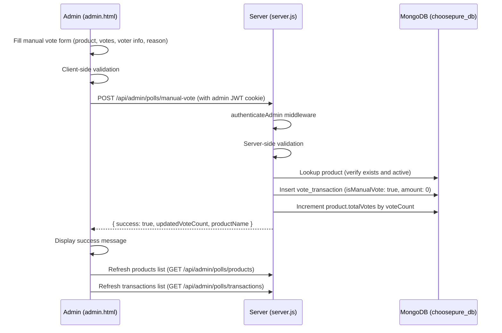

# Design Document: Admin Manual Vote

## Overview

This feature adds a manual vote capability to the Admin Panel's Polling tab, allowing authenticated admins to cast votes for any active product on behalf of a user without requiring Razorpay payment processing. This supports offline payments, promotional grants, corrections, and community engagement campaigns.

The implementation extends the existing polling infrastructure: a new form in `admin.html` (Polling tab), a new POST endpoint in `server.js`, and a new transaction record shape in the `vote_transactions` collection. Manual votes are recorded with `amount: 0` and an `isManualVote: true` flag, keeping them fully auditable while distinguishing them from paid votes. The existing summary aggregation naturally handles revenue exclusion since manual votes carry zero amount.

The architecture follows the established pattern: the admin panel makes authenticated fetch calls to the Express backend, which validates input, writes to MongoDB, and returns the result.

## Architecture



### Integration Points

The manual vote feature integrates with three existing components:

1. **Admin Panel Polling tab** (`admin.html`): A new "Cast Manual Vote" form is added between the "Add New Product" form and the "Products" table. It reuses the existing `.actions` card styling and `.form-group` patterns.

2. **Server endpoints** (`server.js`): A new `POST /api/admin/polls/manual-vote` endpoint is added alongside the existing admin polling endpoints. It uses the same `authenticateAdmin` middleware and follows the same validation/response patterns.

3. **Transactions API** (`GET /api/admin/polls/transactions`): The existing endpoint's projection is extended to include `isManualVote` and `reason` fields so the admin panel can distinguish manual votes visually.

## Components and Interfaces

### New Backend Endpoint

| Method | Endpoint | Auth | Description |
|--------|----------|------|-------------|
| POST | `/api/admin/polls/manual-vote` | `authenticateAdmin` | Cast a manual vote for a product on behalf of a user |

**Request body:**

```json
{
  "productId": "string (required, MongoDB ObjectId)",
  "voteCount": "number (required, integer 1–50)",
  "voterName": "string (required, non-empty)",
  "voterEmail": "string (required, valid email format)",
  "voterPhone": "string (required, exactly 10 digits)",
  "reason": "string (optional)"
}
```

**Success response (200):**

```json
{
  "success": true,
  "message": "Successfully cast 5 votes for Amul Gold Milk",
  "updatedVoteCount": 42
}
```

**Error response (400/404/500):**

```json
{
  "success": false,
  "message": "Descriptive error message"
}
```

### Modified Backend Endpoint

| Method | Endpoint | Change |
|--------|----------|--------|
| GET | `/api/admin/polls/transactions` | Add `isManualVote`, `reason`, and `adminEmail` to the projection |

The existing aggregation for summary stats requires no change: `totalVotes` sums all `voteCount` values (including manual), and `totalRevenue` sums all `amount` values (manual votes have `amount: 0`, so they contribute nothing to revenue).

### Frontend Components (admin.html)

**New: "Cast Manual Vote" form card** — placed in the Polling tab between the existing "Add New Product" form and the "Products" table:

- Product dropdown (`<select>`) populated from the products list (active products only)
- Vote count input (`<input type="number" min="1" max="50">`)
- Voter name input (`<input type="text">`)
- Voter email input (`<input type="email">`)
- Voter phone input (`<input type="tel" pattern="[0-9]{10}">`)
- Reason textarea (`<textarea>`, optional)
- Submit button
- Message div for success/error feedback

**Modified: `displayTransactions()` function** — updated to show a "Manual" badge on transactions where `isManualVote === true`, and display the `reason` text when present.

**New: `submitManualVote()` function** — handles form validation, API call, success/error display, form clearing, and list refresh.

## Data Models

### Vote Transaction Record (Manual Vote)

The manual vote creates a record in the existing `vote_transactions` collection with the following shape:

```javascript
{
  _id: ObjectId,
  productId: ObjectId,        // reference to products._id
  productName: String,        // denormalized product name
  userName: String,           // voter's name (provided by admin)
  userEmail: String,          // voter's email (provided by admin)
  userPhone: String,          // voter's phone (provided by admin)
  voteCount: Number,          // number of votes (1–50)
  amount: 0,                  // always 0 for manual votes
  isManualVote: true,         // flag distinguishing manual from paid votes
  adminEmail: String,         // email of the admin who cast the vote
  reason: String,             // optional reason for the manual vote
  status: "completed",        // always "completed" for manual votes
  createdAt: Date             // timestamp of creation
}
```

This extends the existing `vote_transactions` schema with three new fields: `isManualVote`, `adminEmail`, and `reason`. Existing paid vote records do not have these fields, so the admin panel checks for `isManualVote === true` to identify manual votes. No schema migration is needed — MongoDB's flexible schema handles this naturally.

### Products Collection (No Changes)

The `products` collection is unchanged. The `totalVotes` field is incremented by the manual vote endpoint using the same `$inc` operation as the existing payment verification endpoint.

## Correctness Properties

*A property is a characteristic or behavior that should hold true across all valid executions of a system — essentially, a formal statement about what the system should do. Properties serve as the bridge between human-readable specifications and machine-verifiable correctness guarantees.*

### Property 1: Vote count range validation

*For any* integer value, the server should accept it as a valid vote count if and only if it is between 1 and 50 inclusive. Values outside this range should be rejected with a validation error.

**Validates: Requirements 2.2**

### Property 2: Email format validation

*For any* string submitted as a voter email, the server should accept it if and only if it matches the email format regex `/^[^\s@]+@[^\s@]+\.[^\s@]+$/`. Strings that do not match should be rejected with a validation error.

**Validates: Requirements 2.4**

### Property 3: Phone format validation

*For any* string submitted as a voter phone, the server should accept it if and only if it consists of exactly 10 digit characters matching `/^[0-9]{10}$/`. Strings that do not match should be rejected with a validation error.

**Validates: Requirements 2.5**

### Property 4: Manual vote transaction record completeness

*For any* valid manual vote request (valid product, vote count, voter name, email, phone, and optional reason), the created vote transaction record should contain all of: productId, productName, userName, userEmail, userPhone, voteCount, amount equal to 0, isManualVote equal to true, adminEmail, status equal to "completed", and a createdAt timestamp. When fetched via the admin transactions API, the isManualVote flag and reason field should be present in the response.

**Validates: Requirements 3.2, 5.2**

### Property 5: Vote count increment and response correctness

*For any* active product with N total votes and a valid manual vote of M votes (1 ≤ M ≤ 50), after the manual vote is processed, the product's totalVotes should equal N + M, and the server response should contain the updated vote count N + M.

**Validates: Requirements 3.3, 3.4**

### Property 6: Validation rejects incomplete requests without side effects

*For any* manual vote request that is missing at least one required field (productId, voteCount, voterName, voterEmail, voterPhone) or has an invalid value for any of these fields, the server should return a validation error and the target product's totalVotes should remain unchanged.

**Validates: Requirements 3.5**

### Property 7: Summary aggregation correctness

*For any* set of vote transactions containing a mix of manual votes (amount = 0) and paid votes (amount > 0), the polling summary should report totalVotes as the sum of all voteCount values across all transactions, and totalRevenue as the sum of all amount values (which naturally excludes manual votes since their amount is 0).

**Validates: Requirements 6.1, 6.2**

## Error Handling

| Scenario | Response | HTTP Status |
|----------|----------|-------------|
| Missing productId | `{ success: false, message: "Product selection is required" }` | 400 |
| Vote count outside 1–50 | `{ success: false, message: "Vote count must be between 1 and 50" }` | 400 |
| Missing voter name | `{ success: false, message: "Voter name is required" }` | 400 |
| Invalid email format | `{ success: false, message: "Please enter a valid email address" }` | 400 |
| Invalid phone (not 10 digits) | `{ success: false, message: "Please enter a valid 10-digit phone number" }` | 400 |
| Product not found or inactive | `{ success: false, message: "Product not found or not active" }` | 404 |
| Database not connected | `{ success: false, message: "Database not connected" }` | 500 |
| Admin not authenticated | `{ success: false, message: "Authentication required" }` | 401 |
| Server error during processing | `{ success: false, message: "Failed to cast manual vote" }` | 500 |

Frontend error handling (admin.html):
- Client-side validation errors are displayed inline before submission
- Server error responses are displayed in the form's message div with error styling
- Network errors display "Network error. Please try again."

## Testing Strategy

### Unit Tests

Unit tests cover specific examples and edge cases:

- Manual vote with all valid fields returns success and correct updated vote count
- Manual vote with missing productId returns 400 with descriptive error
- Manual vote with voteCount = 0 and voteCount = 51 returns range error
- Manual vote with empty voter name returns validation error
- Manual vote with invalid email (e.g., "not-an-email") returns validation error
- Manual vote with 9-digit and 11-digit phone returns validation error
- Manual vote for non-existent product ID returns 404
- Manual vote for inactive product returns 404
- Manual vote endpoint returns 401 without admin JWT cookie
- Manual vote with reason field stores reason in transaction record
- Manual vote without reason field stores empty/undefined reason
- Transaction list includes "Manual" badge data for manual vote transactions
- Summary stats include manual votes in total count but not in revenue

### Property-Based Tests

Property-based tests validate universal properties across randomly generated inputs. Use `fast-check` as the PBT library.

Each property test must:
- Run a minimum of 100 iterations
- Reference the design document property with a tag comment
- Use `fast-check` arbitraries to generate random inputs

| Property | Test Description | Generator Strategy |
|----------|-----------------|-------------------|
| Property 1 | Generate random integers, verify acceptance/rejection at [1, 50] boundary | `fc.integer()` for full range |
| Property 2 | Generate random strings, verify email regex match determines acceptance | `fc.string()` and `fc.emailAddress()` |
| Property 3 | Generate random strings, verify 10-digit-only acceptance | `fc.stringOf(fc.constantFrom(...'0123456789'))` with varying lengths |
| Property 4 | Generate valid manual vote data, submit, verify all fields in created record | `fc.record` with valid field generators |
| Property 5 | Generate product with random initial votes and random vote count (1–50), verify N+M | `fc.nat()` for initial, `fc.integer({min:1,max:50})` for votes |
| Property 6 | Generate requests with random missing/invalid fields, verify rejection and no side effects | `fc.record` with optional fields |
| Property 7 | Generate arrays of transactions (mix of manual and paid), verify sum aggregation | `fc.array(fc.record({voteCount: fc.nat(), amount: fc.nat()}))` |

Tag format: `// Feature: admin-manual-vote, Property {N}: {title}`

Example:
```javascript
// Feature: admin-manual-vote, Property 1: Vote count range validation
test('vote count accepted iff in [1, 50]', () => {
  fc.assert(
    fc.property(
      fc.integer({ min: -100, max: 200 }),
      (voteCount) => {
        const result = validateVoteCount(voteCount);
        if (voteCount >= 1 && voteCount <= 50) {
          expect(result.valid).toBe(true);
        } else {
          expect(result.valid).toBe(false);
        }
      }
    ),
    { numRuns: 100 }
  );
});
```
