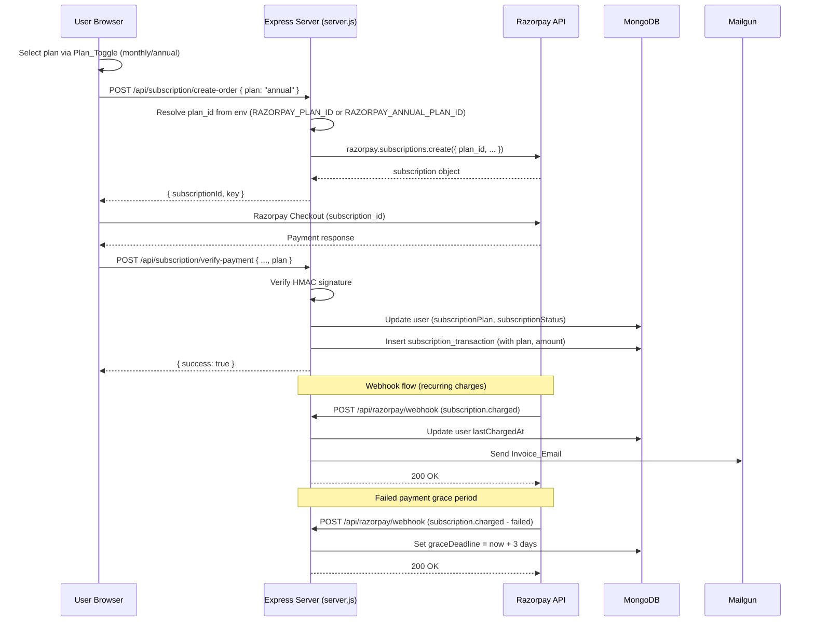

# Design Document: Annual Subscription

## Overview

This design adds an annual billing option (₹2,499/year) alongside the existing monthly plan (₹299/month) for ChoosePure's Premium subscription. The change touches three layers:

1. **Backend (server.js)**: The `/api/subscription/create-order` endpoint gains a `plan` parameter to select between monthly and annual Razorpay plans. The `/api/subscription/verify-payment` endpoint records the plan type on the user document and transaction. A new webhook handler for `subscription.charged` failures introduces a 3-day grace period. A post-charge invoice email is sent via Mailgun.
2. **Frontend – Subscription Modal (purity-wall.html)**: A plan toggle (Monthly / Annual) is added inside the existing `sub-modal`. The subscribe button text, note text, and Razorpay checkout description update dynamically based on the selected plan.
3. **Frontend – Pricing Section (index.html)**: The Premium pricing card gains a plan toggle so visitors can preview both billing options with a "Save ~30%" badge on the annual view.

The `/api/user/me` response is extended with `subscriptionPlan` so the header area on purity-wall.html can display the user's current plan type.

No new collections are introduced. The existing `users` and `subscription_transactions` collections receive additional fields.

## Architecture

The system follows the existing monolithic Express + MongoDB architecture. No new services or infrastructure are introduced.



### Key Design Decisions

1. **Plan ID via environment variables**: Each Razorpay plan is configured externally (`RAZORPAY_PLAN_ID` for monthly, `RAZORPAY_ANNUAL_PLAN_ID` for annual). This avoids hardcoding plan IDs and allows different plans per environment.
2. **Backward compatibility**: If no `plan` parameter is sent to `create-order`, the system defaults to "monthly". This ensures existing clients (mobile app) continue working without changes.
3. **Grace period on the user document**: The `graceDeadline` field lives on the user document rather than a separate collection. The `authenticateUser` middleware and `authenticateSubscribedUser` middleware check this field to allow access during the grace window.
4. **Invoice email is fire-and-forget**: Mailgun send failures are logged but do not block subscription activation, matching the existing pattern for non-critical email sends.

## Components and Interfaces

### Backend API Changes

#### 1. `POST /api/subscription/create-order`

**Current**: Creates a Razorpay subscription using `RAZORPAY_PLAN_ID` (monthly only).

**Updated**: Accepts an optional `plan` parameter in the request body.

```
Request body:
{
  "plan": "monthly" | "annual"   // optional, defaults to "monthly"
}

Response (success):
{
  "success": true,
  "subscriptionId": "sub_xxx",
  "key": "rzp_xxx",
  "plan": "monthly" | "annual"
}

Response (error - invalid plan):
HTTP 400
{ "success": false, "message": "Invalid plan type" }

Response (error - annual unavailable):
HTTP 503
{ "success": false, "message": "Annual plan is currently unavailable" }
```

**Logic**:
- If `plan` is missing or empty, default to `"monthly"`.
- If `plan` is `"monthly"`, use `process.env.RAZORPAY_PLAN_ID`.
- If `plan` is `"annual"`, use `process.env.RAZORPAY_ANNUAL_PLAN_ID`. If the env var is not set, return 503.
- If `plan` is any other value, return 400.
- For annual plans, set `total_count: 1` (single yearly charge). For monthly, keep `total_count: 12`.

#### 2. `POST /api/subscription/verify-payment`

**Current**: Sets `subscriptionStatus: 'subscribed'` and records a transaction with `amount: 299`.

**Updated**: Accepts an optional `plan` parameter. Determines amount from plan type.

```
Request body (additions):
{
  "razorpay_subscription_id": "...",
  "razorpay_payment_id": "...",
  "razorpay_signature": "...",
  "plan": "monthly" | "annual"   // optional, defaults to "monthly"
}
```

**Logic**:
- After signature verification, set `subscriptionPlan` on the user document (`"monthly"` or `"annual"`).
- Record `plan` and correct `amount` (299 for monthly, 2499 for annual) in the subscription transaction.
- Existing referral reward logic remains unchanged.

#### 3. `GET /api/user/me`

**Updated**: Include `subscriptionPlan` in the response.

```
Response user object (additions):
{
  "subscriptionPlan": "monthly" | "annual" | null
}
```

#### 4. `POST /api/razorpay/webhook` — Enhanced handlers

**subscription.charged (success)**:
- Existing: marks user as subscribed, updates `lastChargedAt`.
- New: sends an Invoice_Email via Mailgun with payment amount, date, plan type, payment ID, and next billing date.

**subscription.charged (failed)** / **payment.failed**:
- New: sets `graceDeadline` on the user document to `now + 3 days`.
- If a successful charge arrives during the grace period, removes `graceDeadline`.

**New: Grace period check in `authenticateSubscribedUser`**:
- If `subscriptionStatus` is `"expired"` but `graceDeadline` exists and is in the future, treat user as subscribed.
- A scheduled check (or lazy check on each request) downgrades the user to `"expired"` once `graceDeadline` passes.

#### 5. Startup validation

At server startup, after Razorpay client initialization:
- Log whether `RAZORPAY_ANNUAL_PLAN_ID` is set.
- If not set, log a warning: `"⚠️ RAZORPAY_ANNUAL_PLAN_ID not set — annual subscriptions unavailable"`.

### Frontend Changes

#### Subscription Modal (purity-wall.html)

**Plan Toggle UI**: Two radio-style buttons ("Monthly ₹299/mo" and "Annual ₹2,499/yr") inserted above the subscribe button. Annual is pre-selected by default.

**Dynamic elements**:
| Selected Plan | Subscribe Button Text | Note Text |
|---|---|---|
| Monthly | "Subscribe for ₹299/month" | "MONTHLY ACCESS • CANCEL ANYTIME" |
| Annual | "Subscribe for ₹2,499/year" | "ANNUAL ACCESS • SAVE ~30%" |

**Savings badge**: A green "Save ~30%" pill displayed next to the annual price in the toggle.

**Checkout flow**: `handleSubscribe()` reads the selected plan and passes it to `create-order`. The Razorpay checkout `description` field reflects the plan. On payment failure/cancel, the button text resets to match the currently selected plan.

#### Pricing Section (index.html)

**Plan Toggle**: A toggle switch added above the Premium card price. Defaults to Annual.

| Toggle State | Price Display | Badge |
|---|---|---|
| Monthly | ₹299/month | (none) |
| Annual | ₹2,499/year | "Save ~30%" |

The Free Community card remains unchanged.

#### Purity Wall Header (purity-wall.html)

When a subscribed user is logged in, the header area displays the plan type next to the avatar:
- "Premium · Monthly" or "Premium · Annual"

This is read from the `subscriptionPlan` field returned by `/api/user/me`.

## Data Models

### Users Collection — Updated Fields

```javascript
{
  // ... existing fields ...
  subscriptionStatus: "free" | "subscribed" | "cancelled" | "expired",
  subscriptionPlan: "monthly" | "annual" | null,       // NEW
  subscribedAt: Date,
  razorpaySubscriptionId: String,
  lastChargedAt: Date,
  graceDeadline: Date | null,                           // NEW
  cancelledAt: Date,
  // ... existing fields (referral_code, freeMonthsEarned, subscriptionExpiry, etc.) ...
}
```

**Field details**:
- `subscriptionPlan`: Set to `"monthly"` or `"annual"` on successful payment verification. Set to `null` for free users. Preserved when subscription is cancelled (user retains access until cycle end).
- `graceDeadline`: Set when a recurring charge fails. Cleared on successful payment. If current time passes this date and no payment received, `subscriptionStatus` is set to `"expired"`.

### Subscription Transactions Collection — Updated Fields

```javascript
{
  // ... existing fields ...
  userId: ObjectId,
  userName: String,
  userEmail: String,
  amount: Number,                    // 299 or 2499
  plan: "monthly" | "annual",       // NEW
  razorpaySubscriptionId: String,
  razorpayPaymentId: String,
  razorpaySignature: String,
  status: "active" | "cancelled",
  createdAt: Date,
  cancelledAt: Date
}
```

### Environment Variables — New

| Variable | Description | Required |
|---|---|---|
| `RAZORPAY_ANNUAL_PLAN_ID` | Razorpay plan ID for the annual ₹2,499/year plan | No (annual plan disabled if missing) |

Existing variables (`RAZORPAY_PLAN_ID`, `RAZORPAY_KEY_ID`, `RAZORPAY_KEY_SECRET`, `RAZORPAY_WEBHOOK_SECRET`, `MAILGUN_API_KEY`, `MAILGUN_DOMAIN`, `MAILGUN_FROM_EMAIL`) remain unchanged.


## Correctness Properties

*A property is a characteristic or behavior that should hold true across all valid executions of a system — essentially, a formal statement about what the system should do. Properties serve as the bridge between human-readable specifications and machine-verifiable correctness guarantees.*

### Property 1: Invalid plan types are rejected

*For any* string that is not `"monthly"` and not `"annual"`, when passed as the `plan` parameter to the create-order endpoint, the system SHALL return HTTP 400 with the message "Invalid plan type" and SHALL NOT create a Razorpay subscription.

**Validates: Requirements 3.3**

### Property 2: Grace deadline is exactly 3 calendar days from failure

*For any* failed charge timestamp, the `graceDeadline` set on the user record SHALL equal that timestamp plus exactly 3 calendar days (72 hours).

**Validates: Requirements 5.1**

### Property 3: Grace period access control is date-consistent

*For any* user with a `graceDeadline` and *for any* current date, the user SHALL be treated as "subscribed" for access control if and only if the current date is strictly before the `graceDeadline`. Once the current date is at or past the `graceDeadline` (with no intervening successful payment), the user SHALL be treated as "expired".

**Validates: Requirements 5.2, 5.3**

### Property 4: Invoice email contains all required fields

*For any* valid payment details (amount, payment date, plan type, Razorpay payment ID, next billing date), the generated invoice email body SHALL contain all five of these values.

**Validates: Requirements 6.2**

### Property 5: Pro-rata refund calculation

*For any* annual subscription start date and *for any* refund request date within the annual billing cycle, the pro-rata refund amount SHALL equal `(unusedFullMonths / 12) × 2499`, where `unusedFullMonths` is the number of complete months remaining from the refund request date to the subscription end date.

**Validates: Requirements 7.2**

## Error Handling

| Scenario | Behavior |
|---|---|
| `plan` parameter is not "monthly" or "annual" | Return HTTP 400 `{ success: false, message: "Invalid plan type" }` |
| `RAZORPAY_ANNUAL_PLAN_ID` not configured and user selects annual | Return HTTP 503 `{ success: false, message: "Annual plan is currently unavailable" }` |
| Razorpay subscription creation fails | Return HTTP 500 `{ success: false, message: "Payment initialization failed. Please try again." }` (existing behavior) |
| Payment signature verification fails | Return HTTP 400 `{ success: false, message: "Payment verification failed" }` (existing behavior) |
| Invoice email fails to send (Mailgun error) | Log the error with `console.error`, do NOT block subscription activation. The webhook returns 200 OK regardless. |
| Webhook signature verification fails | Return HTTP 400 `{ success: false }` (existing behavior) |
| Failed recurring charge (subscription.charged failure) | Set `graceDeadline` on user document. User retains access for 3 days. |
| Grace period expires with no payment | Set `subscriptionStatus` to `"expired"` on next access check (lazy evaluation in middleware). |
| Database not connected | Return HTTP 500 `{ success: false, message: "Database not connected" }` (existing behavior) |
| User already subscribed attempts to create order | Return HTTP 400 `{ success: false, message: "Already subscribed" }` (existing behavior) |

## Testing Strategy

### Unit Tests (Example-Based)

Unit tests cover specific scenarios with concrete inputs:

1. **Plan selection in create-order**: Test that `plan="monthly"` uses `RAZORPAY_PLAN_ID`, `plan="annual"` uses `RAZORPAY_ANNUAL_PLAN_ID`, missing plan defaults to monthly.
2. **Plan recording in verify-payment**: Test that `subscriptionPlan` is set correctly on user document and transaction for both plan types. Verify amount is 299 for monthly, 2499 for annual.
3. **Annual plan unavailable**: Test that create-order returns 503 when `RAZORPAY_ANNUAL_PLAN_ID` is not set and plan is "annual".
4. **Grace period recovery**: Test that a successful payment during grace period removes `graceDeadline` and maintains "subscribed" status.
5. **Invoice email failure resilience**: Test that Mailgun failure does not prevent subscription activation.
6. **API response fields**: Test that `/api/user/me` includes `subscriptionPlan` in the response.
7. **Backward compatibility**: Test that existing clients sending no `plan` parameter get monthly behavior.

### Property-Based Tests

Property tests verify universal properties across many generated inputs. Each test runs a minimum of 100 iterations.

| Property | Test Description | Tag |
|---|---|---|
| Property 1 | Generate random non-"monthly"/non-"annual" strings, verify 400 rejection | Feature: annual-subscription, Property 1: Invalid plan types are rejected |
| Property 2 | Generate random timestamps, verify graceDeadline = timestamp + 3 days | Feature: annual-subscription, Property 2: Grace deadline is exactly 3 calendar days from failure |
| Property 3 | Generate random (graceDeadline, currentDate) pairs, verify access iff currentDate < graceDeadline | Feature: annual-subscription, Property 3: Grace period access control is date-consistent |
| Property 4 | Generate random payment details, verify all 5 fields present in email body | Feature: annual-subscription, Property 4: Invoice email contains all required fields |
| Property 5 | Generate random (startDate, refundDate) pairs within a year, verify pro-rata calculation | Feature: annual-subscription, Property 5: Pro-rata refund calculation |

**PBT Library**: [fast-check](https://github.com/dubzzz/fast-check) — the standard property-based testing library for JavaScript/Node.js.

**Configuration**: Each property test runs with `{ numRuns: 100 }` minimum.

### Integration Tests

1. **End-to-end subscription flow**: Create order → Razorpay checkout (mocked) → verify payment → confirm user document and transaction are correct for both monthly and annual plans.
2. **Webhook handling**: Simulate `subscription.charged` (success and failure) webhook events and verify user document updates, grace period logic, and invoice email dispatch.
3. **Cancel subscription**: Verify cancellation works for both plan types and preserves `subscriptionPlan` on the user document.

### Smoke Tests

1. **Startup validation**: Verify server starts and logs appropriate warnings when `RAZORPAY_ANNUAL_PLAN_ID` is not set.
2. **Environment variable reading**: Verify `RAZORPAY_ANNUAL_PLAN_ID` is read from environment at startup.
