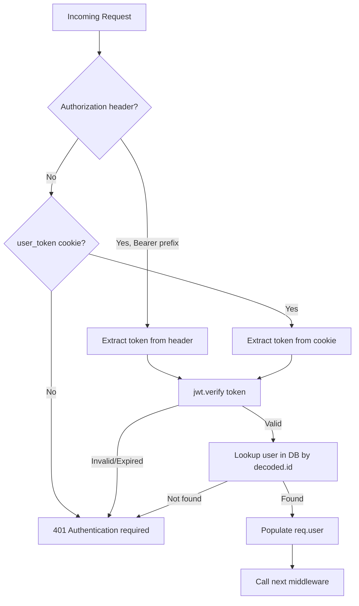

# Design Document: Dual Auth Backend

## Overview

This design documents the dual authentication support in the ChoosePure backend, enabling both the web client (httpOnly cookies) and the React Native mobile app (Bearer tokens) to authenticate against the same API. The majority of this feature is already implemented in `server.js`. This design formalizes the existing patterns, identifies minor gaps, and provides a reference for verification and future maintenance.

### Current State Summary

After reviewing `server.js`, the following is already implemented:

| Capability | Status | Location |
|---|---|---|
| `authenticateUser` reads Bearer header then cookie | ✅ Implemented | Lines 258–310 |
| `authenticateSubscribedUser` delegates to `authenticateUser` | ✅ Implemented | Lines 313–327 |
| Login (`POST /api/user/login`) returns `token` in body + sets cookie | ✅ Implemented | Lines 475–560 |
| Register (`POST /api/user/register`) returns `token` in body + sets cookie | ✅ Implemented | Lines 340–470 |
| Google auth (`POST /api/user/google-auth`) returns `token` in body + sets cookie | ✅ Implemented | Lines 590–800 |
| Reports list (`GET /api/reports`) has optional auth with Bearer + cookie | ✅ Implemented | Lines 3349–3427 |
| Reports detail/PDF use `authenticateSubscribedUser` | ✅ Implemented | Lines 3429–3510 |
| All authenticated endpoints use `authenticateUser` or `authenticateSubscribedUser` | ✅ Implemented | Multiple locations |
| CORS allows web origins with credentials | ✅ Implemented | Lines 211–214 |
| Logout clears cookie | ✅ Implemented | Lines 562–570 |

### Identified Gaps

1. **CORS origin callback**: The current CORS config uses a static array of origins. React Native clients send requests without an `Origin` header. The `cors` npm package with a static origin array will reject requests that have an unexpected origin but will pass through requests with no origin. This is acceptable for native mobile clients, but should be explicitly documented and verified.

2. **No test coverage**: There are no automated tests for the auth middleware or endpoint response shapes. This design introduces a testing strategy to verify the dual-auth contract.

## Architecture

The dual-auth system follows a simple middleware-based pattern within the existing Express monolith:



### Token Priority Rule

When both an Authorization header and a cookie are present, the Bearer token takes priority. This is intentional: the mobile app always sends the Bearer header, and if a web user somehow has both, the explicit header should win.

### Authentication Flow by Client

**Web Client (browser):**
1. User logs in via `POST /api/user/login`
2. Backend sets `user_token` httpOnly cookie (secure, sameSite=none)
3. Browser automatically sends cookie on subsequent requests
4. `authenticateUser` extracts token from cookie

**Mobile App (React Native):**
1. User logs in via `POST /api/user/login`
2. Backend returns `token` in JSON response body (also sets cookie, but mobile ignores it)
3. Mobile app stores token in AsyncStorage
4. Axios interceptor attaches `Authorization: Bearer <token>` to every request
5. `authenticateUser` extracts token from Authorization header

## Components and Interfaces

### authenticateUser Middleware

**Purpose:** Extracts JWT from request, verifies it, looks up the user, and populates `req.user`.

**Input:** Express `req` object  
**Output:** Populates `req.user` with:

```javascript
{
  id: ObjectId,          // user._id
  email: String,         // user.email
  name: String,          // user.name
  phone: String | null,  // user.phone (null for Google users who haven't completed profile)
  subscriptionStatus: String, // 'free' | 'subscribed' | 'cancelled'
  referral_code: String | null,
  freeMonthsEarned: Number,
  subscriptionExpiry: Date | null,
  auth_provider: String  // 'email' | 'google'
}
```

**Token extraction order:**
1. `req.headers.authorization` → strip `Bearer ` prefix
2. `req.cookies.user_token` (fallback)

**Error responses:**
- No token found → `401 { success: false, message: "Authentication required" }`
- Token verification fails → `401 { success: false, message: "Authentication required" }`
- User not found in DB → `401 { success: false, message: "Authentication required" }`

### authenticateSubscribedUser Middleware

**Purpose:** Delegates to `authenticateUser`, then checks subscription status.

**Additional check:** `req.user.subscriptionStatus` must be `'subscribed'` or `'cancelled'`

**Error response on insufficient subscription:**
- `403 { success: false, message: "Subscription required", redirect: "/purity-wall" }`

### Login Endpoint (POST /api/user/login)

**Response body on success:**
```javascript
{
  success: true,
  token: "<JWT string>",  // For mobile storage
  user: {
    name: String,
    email: String,
    phone: String,
    subscriptionStatus: String,
    referral_code: String
  }
}
```

Also sets `user_token` httpOnly cookie with the same JWT.

### Register Endpoint (POST /api/user/register)

**Response body on success:**
```javascript
{
  success: true,
  token: "<JWT string>",  // For mobile storage
  user: {
    name: String,
    email: String,
    subscriptionStatus: 'free',
    referral_code: String
  }
}
```

Also sets `user_token` httpOnly cookie with the same JWT.

### Google Auth Endpoint (POST /api/user/google-auth)

**Response body on success (existing user):**
```javascript
{
  success: true,
  token: "<JWT string>",
  user: {
    name: String,
    email: String,
    phone: String | null,
    subscriptionStatus: String,
    referral_code: String,
    auth_provider: 'google'
  },
  isNewUser: false
}
```

**Response body on success (new user):**
```javascript
{
  success: true,
  token: "<JWT string>",
  user: {
    name: String,
    email: String,
    phone: null,
    subscriptionStatus: 'free',
    referral_code: String,
    auth_provider: 'google'
  },
  isNewUser: true
}
```

Also sets `user_token` httpOnly cookie with the same JWT.

### Reports List Endpoint (GET /api/reports)

**Optional auth logic (inline, not using middleware):**
1. Try to extract token (Bearer header first, then cookie)
2. If token present and valid, check if user is subscribed
3. Subscribed users: `purityScore` included on all reports
4. Unsubscribed/unauthenticated: `purityScore` included only on first report (free sample)
5. Invalid token: treated as unauthenticated (no error returned)

### CORS Configuration

```javascript
cors({
    origin: ['https://choosepure.in', 'https://www.choosepure.in', 'http://localhost:3000'],
    credentials: true
})
```

The `cors` npm package behavior with a static origin array:
- Requests with a matching `Origin` header → allowed with CORS headers
- Requests with a non-matching `Origin` header → CORS headers omitted (browser blocks)
- Requests with **no** `Origin` header → CORS headers omitted but request proceeds (no browser to enforce)

React Native's native HTTP client does not send an `Origin` header, so requests pass through without CORS interference. This is the correct behavior and requires no changes.

### Logout Endpoint (POST /api/user/logout)

Clears the `user_token` cookie. Mobile app handles its own logout by removing the JWT from AsyncStorage. No server-side token invalidation (JWTs are stateless).

## Data Models

### JWT Payload

```javascript
{
  id: String,    // MongoDB ObjectId as string
  email: String, // User's email address
  role: 'user',  // Always 'user' for user tokens
  iat: Number,   // Issued at (auto-set by jsonwebtoken)
  exp: Number    // Expiry (7 days from issuance)
}
```

### User Document (MongoDB)

Relevant fields for dual auth:

```javascript
{
  _id: ObjectId,
  name: String,
  email: String,              // Unique index
  phone: String | null,       // null for Google users pre-profile-completion
  pincode: String | null,
  password: String | null,    // null for Google auth users
  role: 'user',
  auth_provider: 'email' | 'google',  // Defaults to 'email' for legacy users
  google_id: String | null,   // Google sub claim, only for Google users
  subscriptionStatus: 'free' | 'subscribed' | 'cancelled',
  referral_code: String,      // Unique, format CP-XXXXX
  referred_by: ObjectId | null,
  freeMonthsEarned: Number,
  subscriptionExpiry: Date | null,
  last_login: Date,
  createdAt: Date
}
```

### Cookie Configuration

```javascript
{
  name: 'user_token',
  httpOnly: true,
  secure: true,
  sameSite: 'none',
  maxAge: 604800000  // 7 days in milliseconds
}
```

`sameSite: 'none'` with `secure: true` is required because the web frontend (`choosepure.in`) makes cross-origin requests to the API.

## Correctness Properties

*A property is a characteristic or behavior that should hold true across all valid executions of a system — essentially, a formal statement about what the system should do. Properties serve as the bridge between human-readable specifications and machine-verifiable correctness guarantees.*

### Property 1: Token extraction priority and user equivalence

*For any* valid JWT and any request configuration (Bearer header only, cookie only, or both), the `authenticateUser` middleware SHALL extract the Bearer token when an Authorization header is present, fall back to the cookie token otherwise, and populate `req.user` with identical fields regardless of which token source was used.

**Validates: Requirements 1.1, 1.2, 1.3, 9.3**

### Property 2: Invalid token rejection

*For any* string that is not a valid JWT (malformed, expired, or signed with a wrong secret), when sent as a Bearer token or cookie to any authenticated endpoint, the middleware SHALL respond with HTTP 401 and `{ success: false, message: "Authentication required" }`.

**Validates: Requirements 1.5**

### Property 3: Auth endpoint token consistency

*For any* successful authentication (login or registration), the JSON response body SHALL contain a `token` field whose value is a valid JWT, the `Set-Cookie` header SHALL contain a `user_token` cookie with the same JWT value, and decoding that JWT SHALL yield a payload containing `id`, `email`, and `role` fields with a 7-day expiry.

**Validates: Requirements 3.1, 3.2, 3.3, 4.1, 4.2, 4.3**

### Property 4: Subscribed user report visibility

*For any* subscribed user and any set of published reports, when the user sends a valid token (via Bearer header or cookie) to `GET /api/reports`, every report object in the response SHALL include a `purityScore` field.

**Validates: Requirements 6.1, 6.2**

## Error Handling

### Authentication Errors

| Scenario | HTTP Status | Response Body |
|---|---|---|
| No token (no header, no cookie) | 401 | `{ success: false, message: "Authentication required" }` |
| Malformed/expired/invalid JWT | 401 | `{ success: false, message: "Authentication required" }` |
| Valid JWT but user not in DB | 401 | `{ success: false, message: "Authentication required" }` |
| Valid JWT but user is not subscribed (on subscribed endpoints) | 403 | `{ success: false, message: "Subscription required", redirect: "/purity-wall" }` |

### Design Decision: Uniform 401 Messages

All authentication failures return the same message (`"Authentication required"`) regardless of the specific cause (missing token, expired token, user not found). This is intentional to prevent information leakage — an attacker cannot distinguish between a bad token and a deleted account.

### Reports Endpoint Error Handling

The `GET /api/reports` endpoint uses a try/catch around token verification. If the token is invalid, the error is silently caught and the request is treated as unauthenticated. This is correct behavior — the reports list is a public endpoint with optional auth enhancement.

### Database Connection Errors

All endpoints check `isDbConnected` and the relevant collection variable before proceeding. If the database is not connected, they return `500 { success: false, message: "Database not connected" }`.

## Testing Strategy

### Test Framework Setup

The project currently has no test framework. The testing strategy uses:
- **Jest** as the test runner (standard for Node.js/Express projects)
- **Supertest** for HTTP endpoint testing (sends requests to the Express app without starting a server)
- **fast-check** for property-based testing (JavaScript PBT library)

### Dual Testing Approach

**Property-based tests** verify the four correctness properties above:
- Token extraction priority across all combinations of header/cookie presence
- Invalid token rejection across a wide range of malformed inputs
- Auth response token consistency across login and registration with varied user data
- Subscribed user report visibility across different report sets

**Unit/example-based tests** cover:
- Specific edge cases (no token at all, user not found in DB)
- Subscription middleware (free user blocked, subscribed user allowed)
- Logout clears cookie
- CORS allows requests without Origin header
- Reports endpoint: unauthenticated sees purityScore only on first report
- Reports endpoint: invalid token treated as unauthenticated
- Google auth returns token in body (integration test with mocked Google OAuth)

### Property Test Configuration

- Minimum 100 iterations per property test
- Each property test references its design document property
- Tag format: **Feature: dual-auth-backend, Property {number}: {property_text}**

### Test File Structure

```
tests/
  auth-middleware.test.js       # Property tests for Properties 1 & 2
  auth-endpoints.test.js        # Property test for Property 3 + example tests for login/register/google-auth
  reports-auth.test.js           # Property test for Property 4 + example tests for reports endpoint
  cors.test.js                   # Example tests for CORS behavior
  logout.test.js                 # Example tests for logout
```

### Test Dependencies

```json
{
  "devDependencies": {
    "jest": "^29.x",
    "supertest": "^6.x",
    "fast-check": "^3.x"
  }
}
```

### What Is NOT Tested

- Google OAuth token verification (external service — mocked in integration tests)
- Mobile app AsyncStorage behavior (mobile-side concern, tested in mobile app)
- Actual MongoDB operations (tests use a test database or in-memory mock)
- Cookie behavior in real browsers (tested manually or via E2E tests)

