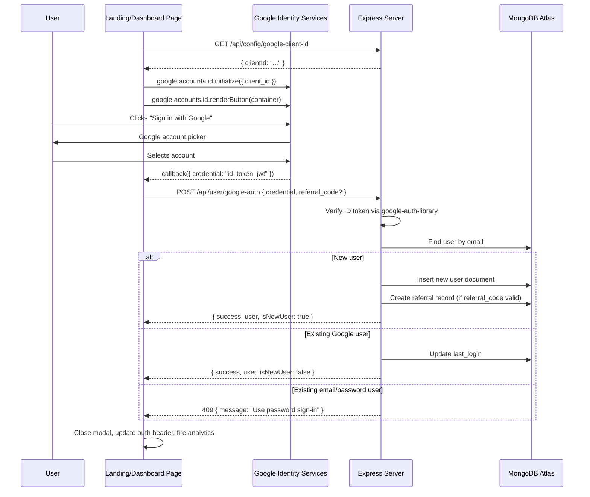

# Design Document: Google Authentication

## Overview

This design adds Google Sign-In as an alternative authentication method to the ChoosePure web application. The feature integrates Google Identity Services (GIS) on the frontend (both `index.html` and `purity-wall.html`) and uses the `google-auth-library` npm package on the backend to verify Google ID tokens. The system follows a unified endpoint pattern — a single `POST /api/user/google-auth` endpoint handles both new user auto-registration and returning user sign-in based on whether the email already exists in the database.

Key design decisions:
- **Single endpoint for sign-in and registration**: The Google auth flow doesn't distinguish between sign-in and registration from the user's perspective. The backend determines the action based on existing user lookup.
- **No password for Google users**: Google-authenticated users have `password: null` and `auth_provider: "google"` in their user document. They cannot use the forgot-password flow.
- **Account linking prevention**: If an email is already registered via email/password (`auth_provider: "email"`), Google sign-in is rejected with a clear message. This avoids accidental account merging.
- **Dynamic Google Client ID**: The frontend fetches the Google Client ID from a server endpoint (`GET /api/config/google-client-id`) rather than hardcoding it, allowing per-environment configuration.
- **Optional profile completion**: Since Google doesn't provide phone or pincode, these fields are nullable for Google users. A non-blocking banner prompts completion on the dashboard.

## Architecture

The feature extends the existing authentication architecture without replacing it. The flow is:



### Component Boundaries

- **Frontend (index.html, purity-wall.html)**: Loads GIS library, renders Google button in auth modals, handles callback, sends credential to backend, updates UI.
- **Backend (server.js)**: New endpoint for Google auth, config endpoint for client ID, profile update endpoint, modifications to `/api/user/me` and forgot-password.
- **Database (MongoDB)**: Extended user schema with `auth_provider`, `google_id` fields. Existing indexes on `email` remain.

## Components and Interfaces

### Backend API Endpoints

#### 1. `GET /api/config/google-client-id`

Returns the Google Client ID for frontend initialization.

**Request**: No parameters.

**Response (200)**:
```json
{ "clientId": "123456789.apps.googleusercontent.com" }
```

**Response (503)** — when `GOOGLE_CLIENT_ID` env var is not set:
```json
{ "success": false, "message": "Google authentication is not configured" }
```

#### 2. `POST /api/user/google-auth`

Unified Google authentication endpoint. Handles both new user registration and existing user sign-in.

**Request body**:
```json
{
  "credential": "<Google ID token JWT>",
  "referral_code": "CP-XXXXX"  // optional
}
```

**Processing logic**:
1. Check `GOOGLE_CLIENT_ID` is configured → 503 if not
2. Verify `credential` using `google-auth-library`'s `OAuth2Client.verifyIdToken()` with `audience` set to `GOOGLE_CLIENT_ID` → 401 if invalid
3. Extract `email`, `name`, `sub`, `email_verified` from token payload
4. Check `email_verified` is true → 400 if not
5. Look up user by email in `usersCollection`
6. If no user exists → auto-register (create user document, handle referral, generate referral code)
7. If user exists with `auth_provider: "google"` → sign in (update `last_login`)
8. If user exists with `auth_provider: "email"` → reject with 409

**Response (200)** — success:
```json
{
  "success": true,
  "token": "<JWT>",
  "user": {
    "name": "User Name",
    "email": "user@gmail.com",
    "phone": null,
    "subscriptionStatus": "free",
    "referral_code": "CP-XXXXX",
    "auth_provider": "google"
  },
  "isNewUser": true
}
```

**Error responses**:
- `401`: `{ "success": false, "message": "Invalid Google token" }`
- `400`: `{ "success": false, "message": "Google account email is not verified" }`
- `409`: `{ "success": false, "message": "This email is registered with email/password. Please sign in with your password." }`
- `503`: `{ "success": false, "message": "Google authentication is not configured" }`

#### 3. `PUT /api/user/profile`

Protected by `authenticateUser` middleware. Allows Google users to complete their profile.

**Request body**:
```json
{
  "phone": "9876543210",
  "pincode": "560001"
}
```

**Validation**:
- `phone`: exactly 10 digits (`/^[0-9]{10}$/`)
- `pincode`: exactly 6 digits (`/^[0-9]{6}$/`)
- Phone uniqueness check against `usersCollection`

**Response (200)**:
```json
{ "success": true, "message": "Profile updated successfully" }
```

**Error responses**:
- `400`: Invalid phone/pincode format or phone already registered

#### 4. Modified `GET /api/user/me`

Add `auth_provider` to the response so the frontend can adjust UI (hide forgot-password for Google users).

**Updated response**:
```json
{
  "success": true,
  "user": {
    "name": "...",
    "email": "...",
    "phone": "...",
    "subscriptionStatus": "...",
    "referral_code": "...",
    "freeMonthsEarned": 0,
    "subscriptionExpiry": null,
    "auth_provider": "google"
  }
}
```

#### 5. Modified `POST /api/user/forgot-password`

Add a check: if the user has `auth_provider: "google"`, return 400 with message "This account uses Google sign-in. Please sign in with Google."

### Frontend Components

#### Google Button Container

A `<div>` element placed above the email/password form fields in both Sign In and Register tabs of the auth modal, separated by an "or" divider. The GIS library renders the standard Google-branded button into this container.

```html
<div id="google-signin-btn-signin" class="google-btn-container"></div>
<div class="auth-divider"><span>or</span></div>
```

#### GIS Initialization

On page load, the frontend:
1. Fetches `GET /api/config/google-client-id`
2. Calls `google.accounts.id.initialize({ client_id, callback: handleGoogleAuth })`
3. Renders the button into each tab's container using `google.accounts.id.renderButton()`

#### `handleGoogleAuth(response)` Callback

1. Shows loading state in the Google button area
2. Sends `POST /api/user/google-auth` with `{ credential: response.credential, referral_code }`
3. On success: calls `updateAuthHeader(data.user)`, closes modal, fires analytics events
4. On error: displays error message in the active tab's error area

#### Profile Completion Banner

A dismissible banner shown on `purity-wall.html` when `currentUser.phone === null`. Contains inline inputs for phone and pincode with a submit button that calls `PUT /api/user/profile`.

### Environment Configuration

| Variable | Description | Required |
|---|---|---|
| `GOOGLE_CLIENT_ID` | OAuth 2.0 Client ID from Google Cloud Console | Yes (for Google auth) |

### Dependencies

**New npm package**: `google-auth-library` — Google's official Node.js library for verifying ID tokens. Already listed in the project brief.

## Data Models

### User Document (Extended)

Two new fields added to the existing user document in the `users` collection:

```javascript
{
  // Existing fields
  name: String,
  email: String,           // unique index (already exists)
  phone: String | null,    // null for Google users until profile completion
  pincode: String | null,  // null for Google users until profile completion
  password: String | null, // null for Google users
  role: "user",
  subscriptionStatus: "free" | "subscribed" | "cancelled",
  referral_code: String,
  referred_by: ObjectId | null,
  freeMonthsEarned: Number,
  subscriptionExpiry: Date | null,
  createdAt: Date,
  last_login: Date,

  // New fields
  auth_provider: "email" | "google",  // how the user registered
  google_id: String | null            // Google `sub` claim, null for email users
}
```

**Migration note**: Existing users don't have `auth_provider` or `google_id`. The backend treats missing `auth_provider` as `"email"` (backward compatible). No data migration is needed — the field is set on new registrations and can be backfilled for existing users by checking `password !== null`.

### Referral Record (Unchanged)

The existing referral document structure is reused for Google sign-up referrals:

```javascript
{
  referrer_user_id: ObjectId,
  referee_user_id: ObjectId,
  status: "pending",
  reward_granted: false,
  created_at: Date,
  completed_at: null
}
```


## Correctness Properties

*A property is a characteristic or behavior that should hold true across all valid executions of a system — essentially, a formal statement about what the system should do. Properties serve as the bridge between human-readable specifications and machine-verifiable correctness guarantees.*

### Property 1: Token verification extracts correct payload

*For any* valid Google ID token payload containing an email, name, and sub claim, when the token is verified successfully by the google-auth-library mock, the Google auth endpoint SHALL extract and use the exact email, name, and sub values from the payload for subsequent user lookup and creation.

**Validates: Requirements 2.1, 2.2**

### Property 2: Auto-registration creates correct user document

*For any* valid Google ID token with a verified email that does not match any existing user in the database, the Google auth endpoint SHALL create a user document with `auth_provider` set to `"google"`, `google_id` matching the token's `sub` claim, `password` set to `null`, `phone` set to `null`, `pincode` set to `null`, `role` set to `"user"`, `subscriptionStatus` set to `"free"`, a non-null `referral_code` matching the pattern `CP-XXXXX`, a `createdAt` timestamp, and SHALL return a response with `isNewUser: true`, a valid JWT token, and the user's name, email, subscription status, and referral code.

**Validates: Requirements 3.1, 3.2, 3.3**

### Property 3: Existing Google user sign-in succeeds

*For any* existing user with `auth_provider` set to `"google"`, when a valid Google ID token with the same email is presented to the Google auth endpoint, the endpoint SHALL return a successful response with `isNewUser: false`, a valid JWT token, the user's current profile, and SHALL update the `last_login` timestamp.

**Validates: Requirements 4.1, 4.3, 11.3**

### Property 4: Email/password user rejection on Google sign-in

*For any* existing user with `auth_provider` set to `"email"` (or `auth_provider` not set, indicating a legacy email user), when a valid Google ID token with the same email is presented to the Google auth endpoint, the endpoint SHALL return a 409 response with the message "This email is registered with email/password. Please sign in with your password." and SHALL NOT modify the user document.

**Validates: Requirements 4.2, 11.2**

### Property 5: Referral application during Google registration

*For any* valid referral code belonging to a different user and any new Google user being auto-registered, the Google auth endpoint SHALL set `referred_by` to the referrer's user ID on the new user document and create a referral record with `status` set to `"pending"` and `reward_granted` set to `false`.

**Validates: Requirements 5.1, 5.2**

### Property 6: Phone and pincode validation

*For any* string, the profile update endpoint SHALL accept the string as a valid phone number if and only if it consists of exactly 10 digit characters, and SHALL accept the string as a valid pincode if and only if it consists of exactly 6 digit characters.

**Validates: Requirements 8.2**

### Property 7: Phone uniqueness enforcement

*For any* phone number that is already associated with a different user in the database, the profile update endpoint SHALL reject the update with a 400 response and the message "This phone number is already registered".

**Validates: Requirements 8.3**

### Property 8: Google user password reset rejection

*For any* user with `auth_provider` set to `"google"`, when a password reset is requested via the forgot-password endpoint using that user's email, the endpoint SHALL return a 400 response with the message "This account uses Google sign-in. Please sign in with Google."

**Validates: Requirements 9.3**

## Error Handling

### Backend Error Scenarios

| Scenario | HTTP Status | Response Message | Action |
|---|---|---|---|
| `GOOGLE_CLIENT_ID` env var not set | 503 | "Google authentication is not configured" | Return early, do not attempt verification |
| Invalid/expired Google ID token | 401 | "Invalid Google token" | Catch `google-auth-library` verification error |
| Token `email_verified` is false or missing | 400 | "Google account email is not verified" | Check payload after verification |
| Email exists with `auth_provider: "email"` | 409 | "This email is registered with email/password. Please sign in with your password." | Prevent account linking |
| Google user requests password reset | 400 | "This account uses Google sign-in. Please sign in with Google." | Check `auth_provider` before sending reset email |
| Phone validation fails (not 10 digits) | 400 | "Please enter a valid 10-digit phone number" | Regex validation |
| Pincode validation fails (not 6 digits) | 400 | "Please enter a valid 6-digit pincode" | Regex validation |
| Phone already registered | 400 | "This phone number is already registered" | Uniqueness check |
| Database not connected | 500 | "Database not connected" | Check `isDbConnected` flag |
| Unexpected server error | 500 | "Authentication failed" / "Profile update failed" | Catch-all try/catch |

### Frontend Error Handling

- **GIS library fails to load**: The Google button container remains empty. Email/password auth continues to work normally. No error is shown unless the user explicitly tries to use Google sign-in.
- **Config endpoint fails**: Google button is not rendered. A console warning is logged. Email/password auth is unaffected.
- **Google auth API error**: The error message from the backend is displayed in the auth modal's error area for the currently active tab.
- **Network error during Google auth**: A generic "Network error. Please try again." message is shown.

## Testing Strategy

### Unit Tests (Example-Based)

Unit tests cover specific scenarios, edge cases, and UI behavior:

- **Google auth endpoint**: Test with valid token (new user), valid token (existing Google user), valid token (existing email user → 409), invalid token (→ 401), unverified email (→ 400), missing `GOOGLE_CLIENT_ID` (→ 503)
- **Profile update endpoint**: Test with valid phone/pincode, invalid phone format, invalid pincode format, duplicate phone, unauthenticated request
- **Forgot password modification**: Test Google user requesting reset (→ 400), email user requesting reset (existing behavior unchanged)
- **`/api/user/me` response**: Verify `auth_provider` field is included for both Google and email users
- **Referral edge cases**: Self-referral prevention, invalid referral code (registration proceeds), referral code on existing user sign-in (ignored)
- **Frontend**: Auth modal shows Google button, divider renders, error messages display, loading state appears, profile completion banner shows for Google users with null phone, forgot password link hidden for Google users

### Property-Based Tests

Property-based tests verify universal properties across generated inputs using the `fast-check` library. Each test runs a minimum of 100 iterations.

| Property | Test Description | Tag |
|---|---|---|
| Property 1 | Generate random token payloads, verify field extraction | Feature: google-auth, Property 1: Token verification extracts correct payload |
| Property 2 | Generate random new Google users, verify document creation and response | Feature: google-auth, Property 2: Auto-registration creates correct user document |
| Property 3 | Generate random existing Google users, verify sign-in response and last_login update | Feature: google-auth, Property 3: Existing Google user sign-in succeeds |
| Property 4 | Generate random existing email users, verify 409 rejection | Feature: google-auth, Property 4: Email/password user rejection on Google sign-in |
| Property 5 | Generate random valid referral codes and new Google users, verify referral record creation | Feature: google-auth, Property 5: Referral application during Google registration |
| Property 6 | Generate random strings, verify phone accepts exactly 10 digits and pincode accepts exactly 6 digits | Feature: google-auth, Property 6: Phone and pincode validation |
| Property 7 | Generate random phone numbers that exist on other users, verify 400 rejection | Feature: google-auth, Property 7: Phone uniqueness enforcement |
| Property 8 | Generate random Google users, verify forgot-password returns 400 | Feature: google-auth, Property 8: Google user password reset rejection |

### Integration Tests

- End-to-end Google auth flow with mocked GIS library
- Frontend analytics event firing (GA4, Meta Pixel, Mixpanel) on registration and sign-in
- GIS initialization with dynamically fetched client ID
- Profile completion banner interaction and API call

### Test Configuration

- **Library**: `fast-check` (property-based testing for JavaScript)
- **Test runner**: Tests can be run with any Node.js test runner (Jest, Vitest, or Node's built-in test runner)
- **Mocking**: `google-auth-library`'s `OAuth2Client.verifyIdToken()` is mocked in all property and unit tests to avoid external API calls
- **Database**: Use an in-memory MongoDB instance or mock the collection methods for isolated testing
- **Minimum iterations**: 100 per property test
