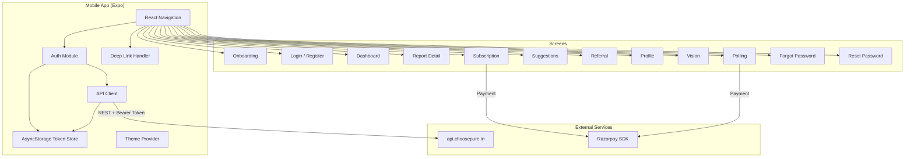
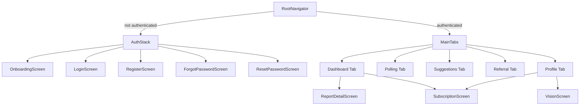

# Design Document: ChoosePure Mobile App

## Overview

This design describes a React Native (Expo managed workflow) mobile application that mirrors the existing ChoosePure web platform. The app connects to the existing Node.js/Express backend at `api.choosepure.in` using Bearer token authentication (as opposed to the web's httpOnly cookie approach). The backend requires a small modification to its `authenticateUser` middleware to support dual auth (cookies + Authorization header).

The app covers: authentication, purity dashboard, test report detail, product polling with Razorpay payments, product suggestions/upvoting, subscription management, referral program, profile, and deep linking.

## Architecture



### Key Architectural Decisions

1. **Expo Managed Workflow**: Simplifies build/deploy for both platforms. `react-native-razorpay` requires a custom dev client (`expo-dev-client`) since it has native modules.
2. **Bearer Token Auth**: Mobile stores JWT in AsyncStorage and sends it via `Authorization: Bearer <token>` header. The backend is modified to check this header in addition to cookies.
3. **React Context for State**: `AuthContext` holds user state and token. No Redux needed — the app's state is simple (user object, auth status).
4. **Centralized API Client**: A single `apiClient` module (Axios instance) with interceptors for token injection and 401 handling.
5. **React Navigation**: Bottom tab navigator for main screens, stack navigators for auth flow and nested screens.

## Components and Interfaces

### Project Structure

```
mobile app/
├── app.json                    # Expo config (deep linking, splash, icons)
├── App.js                      # Entry point — providers + navigation
├── package.json
├── babel.config.js
├── src/
│   ├── api/
│   │   └── client.js           # Axios instance with Bearer token interceptor
│   ├── context/
│   │   └── AuthContext.js       # Auth state, login/logout/register actions
│   ├── hooks/
│   │   └── useDeepLink.js      # Deep link handler hook
│   ├── navigation/
│   │   ├── AuthStack.js        # Login, Register, ForgotPassword, ResetPassword
│   │   ├── MainTabs.js         # Bottom tab navigator
│   │   └── RootNavigator.js    # Switches between AuthStack and MainTabs
│   ├── screens/
│   │   ├── OnboardingScreen.js
│   │   ├── LoginScreen.js
│   │   ├── RegisterScreen.js
│   │   ├── ForgotPasswordScreen.js
│   │   ├── ResetPasswordScreen.js
│   │   ├── DashboardScreen.js
│   │   ├── ReportDetailScreen.js
│   │   ├── PollingScreen.js
│   │   ├── SuggestionScreen.js
│   │   ├── ReferralScreen.js
│   │   ├── ProfileScreen.js
│   │   ├── VisionScreen.js
│   │   └── SubscriptionScreen.js
│   ├── theme/
│   │   └── index.js            # Colors, typography, spacing constants
│   └── utils/
│       └── validation.js       # Form validation helpers
```

### API Client Module (`src/api/client.js`)

```javascript
// Axios instance configured for api.choosepure.in
// - Request interceptor: reads token from AsyncStorage, sets Authorization header
// - Response interceptor: on 401, clears token and triggers auth reset
// - Base URL: https://api.choosepure.in

const apiClient = axios.create({
  baseURL: 'https://api.choosepure.in',
  timeout: 15000,
  headers: { 'Content-Type': 'application/json' },
});

// Request interceptor
apiClient.interceptors.request.use(async (config) => {
  const token = await AsyncStorage.getItem('jwt_token');
  if (token) {
    config.headers.Authorization = `Bearer ${token}`;
  }
  return config;
});

// Response interceptor — handle 401 globally
apiClient.interceptors.response.use(
  (response) => response,
  async (error) => {
    if (error.response?.status === 401) {
      await AsyncStorage.removeItem('jwt_token');
      // Trigger navigation to login via AuthContext
    }
    return Promise.reject(error);
  }
);
```

### Auth Context (`src/context/AuthContext.js`)

```
Interface AuthContext {
  user: User | null
  isLoading: boolean
  isAuthenticated: boolean
  login(email, password): Promise<void>
  register(name, email, phone, pincode, password, referralCode?): Promise<void>
  logout(): Promise<void>
  checkAuth(): Promise<void>   // called on app launch — validates stored token
}
```

Actions:
- `login`: POST `/api/user/login` → store token from response body, set user state
- `register`: POST `/api/user/register` → store token from response body, set user state
- `logout`: POST `/api/user/logout` → clear AsyncStorage token, reset user state
- `checkAuth`: GET `/api/user/me` → if valid, set user state; if 401, clear token

### Navigation Architecture



### Screen Data Flow Summary

| Screen | API Endpoints | Key State |
|--------|--------------|-----------|
| DashboardScreen | GET `/api/reports` | reports[], subscriptionStatus |
| ReportDetailScreen | GET `/api/reports/:id`, GET `/api/reports/:id/pdf` | report object |
| PollingScreen | GET `/api/polls/products`, POST `/api/polls/vote`, POST `/api/polls/verify-payment`, GET `/api/polls/free-vote-status`, POST `/api/polls/free-vote` | products[], freeVoteEligible |
| SuggestionScreen | GET `/api/suggestions`, POST `/api/suggestions`, POST `/api/suggestions/:id/upvote` | suggestions[] |
| ReferralScreen | GET `/api/user/referral-stats` | referralStats |
| ProfileScreen | cached user from AuthContext | user |
| SubscriptionScreen | POST `/api/subscription/create-order`, POST `/api/subscription/verify-payment` | subscriptionStatus |

### Backend Modifications (Dual Auth Support)

The `authenticateUser` middleware in `server.js` currently only reads `req.cookies.user_token`. It needs to also check the `Authorization` header:

```javascript
async function authenticateUser(req, res, next) {
    // 1. Check Authorization header first (mobile)
    let token = null;
    const authHeader = req.headers.authorization;
    if (authHeader && authHeader.startsWith('Bearer ')) {
        token = authHeader.substring(7);
    }
    // 2. Fall back to cookie (web)
    if (!token) {
        token = req.cookies.user_token;
    }
    
    if (!token) {
        return res.status(401).json({ success: false, message: 'Authentication required' });
    }
    // ... rest unchanged (jwt.verify, user lookup, etc.)
}
```

The same pattern applies to the optional auth check in `GET /api/reports` (line ~2880 in server.js).

The login and register endpoints must also return the token in the response body:

```javascript
// In login and register responses, add:
res.json({ 
    success: true, 
    token: token,  // <-- ADD THIS for mobile
    user: { name, email, ... } 
});
```

### Razorpay Integration (Mobile)

The `react-native-razorpay` SDK is used for both polling votes and subscriptions. Since it has native modules, the project uses `expo-dev-client` for custom builds.

```javascript
import RazorpayCheckout from 'react-native-razorpay';

// For polling vote payment:
// 1. POST /api/polls/vote → get { orderId, amount, currency }
// 2. Open Razorpay checkout with order details
// 3. On success → POST /api/polls/verify-payment with payment details

// For subscription:
// 1. POST /api/subscription/create-order → get { subscriptionId }
// 2. Open Razorpay checkout with subscription_id
// 3. On success → POST /api/subscription/verify-payment with subscription details

const options = {
    key: RAZORPAY_KEY_ID,  // public key from env/config
    subscription_id: subscriptionId,  // or order_id for one-time
    name: 'ChoosePure',
    description: 'Monthly Subscription - ₹299',
    prefill: { email: user.email, contact: user.phone },
    theme: { color: '#1F6B4E' },
};

RazorpayCheckout.open(options)
    .then((data) => { /* verify payment */ })
    .catch((error) => { /* handle failure/cancel */ });
```

### Deep Linking Configuration

In `app.json`:
```json
{
  "expo": {
    "scheme": "choosepure",
    "web": {
      "bundler": "metro"
    },
    "plugins": [
      ["expo-linking"]
    ]
  }
}
```

The `useDeepLink` hook listens for incoming URLs:
- `choosepure.in/purity-wall?ref=CP-XXXXX` → navigate to Register with referral code pre-filled
- `choosepure.in/user/reset-password?token=XXXXX` → navigate to ResetPassword with token

Universal links / app links are configured via `apple-app-site-association` and `assetlinks.json` on the `choosepure.in` domain for production.

### Theme System (`src/theme/index.js`)

```javascript
export const theme = {
    colors: {
        primary: '#1F6B4E',       // Deep Leaf Green
        background: '#FAFAF7',    // Pure Ivory
        accent: '#8A6E4B',        // Grain Brown
        text: '#1A1A1A',
        textSecondary: '#666666',
        error: '#D32F2F',
        success: '#2E7D32',
        border: '#E0E0E0',
        cardBackground: '#FFFFFF',
        locked: '#BDBDBD',
    },
    fonts: {
        regular: 'Inter_400Regular',
        medium: 'Inter_500Medium',
        semiBold: 'Inter_600SemiBold',
        bold: 'Inter_700Bold',
    },
    spacing: {
        xs: 4, sm: 8, md: 16, lg: 24, xl: 32,
    },
    borderRadius: {
        sm: 8, md: 12, lg: 16,
    },
};
```

Fonts loaded via `@expo-google-fonts/inter` package.

### State Management

- **AuthContext**: User object, token, auth status. Provided at app root.
- **Per-screen local state**: Each screen manages its own data fetching with `useState` + `useEffect`. No global store needed.
- **Pull-to-refresh**: Screens with lists (Dashboard, Polling, Suggestions) use `RefreshControl`.
- **Optimistic updates**: Upvote and vote counts update locally before server confirmation, with rollback on failure.

## Data Models

### User (from AuthContext)

```typescript
interface User {
    name: string;
    email: string;
    phone: string;
    subscriptionStatus: 'free' | 'subscribed' | 'cancelled';
    referral_code: string;
    freeMonthsEarned: number;
    subscriptionExpiry: string | null;
}
```

### Report Card (Dashboard)

```typescript
interface ReportCard {
    _id: string;
    productName: string;
    brandName: string;
    category: string;
    imageUrl: string;
    statusBadges: string[];
    purityScore?: number;       // present only for subscribers or first report
    reportUrl: string;
}
```

### Full Report (Detail)

```typescript
interface FullReport extends ReportCard {
    testParameters: object;
    expertCommentary: string;
    methodology: string;
    batchCode: string;
    shelfLife: string;
    testDate: string;
}
```

### Poll Product

```typescript
interface PollProduct {
    _id: string;
    name: string;
    brand: string;
    category: string;
    imageUrl: string;
    totalVotes: number;
    isActive: boolean;
}
```

### Suggestion

```typescript
interface Suggestion {
    _id: string;
    productName: string;
    category: string;
    reason?: string;
    upvotes: number;
    upvotedBy: string[];
    status: 'pending' | 'approved' | 'rejected';
    createdAt: string;
}
```

### Referral Stats

```typescript
interface ReferralStats {
    referral_code: string;
    referral_link: string;
    total_invited: number;
    completed: number;
    pending: number;
    free_months_earned: number;
}
```

### Token Storage

```
AsyncStorage keys:
  'jwt_token'       → JWT string
  'onboarding_done' → 'true' | null
```


## Correctness Properties

*A property is a characteristic or behavior that should hold true across all valid executions of a system — essentially, a formal statement about what the system should do. Properties serve as the bridge between human-readable specifications and machine-verifiable correctness guarantees.*

### Property 1: Bearer Token Header Construction

*For any* arbitrary non-empty JWT token string stored in AsyncStorage, the API client request interceptor SHALL produce an `Authorization` header whose value is exactly `"Bearer "` concatenated with that token string.

**Validates: Requirements 1.3**

### Property 2: Registration Form Validation

*For any* combination of form inputs (name, email, phone, pincode, password), the validation function SHALL return an error for name if and only if it is empty/whitespace, for email if and only if it does not match a valid email format, for phone if and only if it is not exactly 10 digits, for pincode if and only if it is not exactly 6 digits, and for password if and only if it is fewer than 8 characters.

**Validates: Requirements 2.1**

### Property 3: Deep Link Referral Code Round-Trip

*For any* string matching the referral code pattern `CP-XXXXX`, constructing the URL `choosepure.in/purity-wall?ref=<code>` and then parsing it with the Deep_Link_Handler SHALL extract the original referral code unchanged.

**Validates: Requirements 17.1, 2.3**

### Property 4: Deep Link Reset Token Round-Trip

*For any* non-empty token string, constructing the URL `choosepure.in/user/reset-password?token=<token>` and then parsing it with the Deep_Link_Handler SHALL extract the original token string unchanged.

**Validates: Requirements 17.2, 3.3**

### Property 5: Report Purity Score Visibility

*For any* list of reports and any subscription status (free, subscribed, cancelled), the report card mapping function SHALL include `purityScore` on the first report (index 0) regardless of status, SHALL include `purityScore` on all reports when the user is a subscriber (subscribed or cancelled with active expiry), and SHALL exclude `purityScore` from all reports at index > 0 when the user is not a subscriber.

**Validates: Requirements 5.2, 5.3, 5.4**

### Property 6: Backend Dual Auth with Header Priority

*For any* valid JWT token, the `authenticateUser` middleware SHALL authenticate the user when the token is provided via the `Authorization: Bearer` header, when provided via the `user_token` cookie, or when provided via both. When both are present with different tokens, the middleware SHALL use the token from the Authorization header.

**Validates: Requirements 15.1, 15.2**

## Error Handling

### API Client Error Strategy

| Error Type | Detection | User Feedback | Recovery |
|-----------|-----------|---------------|----------|
| Network error | Axios `error.message === 'Network Error'` or no `error.response` | "No internet connection. Please check your network." + retry button | Retry on tap |
| 401 Unauthorized | `error.response.status === 401` | Silent — redirect to login | Clear token, navigate to AuthStack |
| 400 Bad Request | `error.response.status === 400` | Display `error.response.data.message` (backend validation message) | User corrects input |
| 403 Forbidden | `error.response.status === 403` | "Subscription required" prompt | Navigate to SubscriptionScreen |
| 5xx Server Error | `error.response.status >= 500` | "Something went wrong. Please try again later." | Retry button |
| Razorpay Cancel | Razorpay `onDismiss` / error code | "Payment cancelled" | Allow retry |
| Razorpay Failure | Razorpay error response | "Payment failed. Please try again." | Allow retry |

### Offline Handling

- Use `@react-native-community/netinfo` to monitor connectivity
- Display a persistent banner at the top of the screen when offline
- Disable action buttons (vote, subscribe, submit) when offline
- Auto-retry data fetch when connectivity is restored

### Loading States

- Screens show skeleton placeholders or `ActivityIndicator` while fetching data
- Buttons show a spinner and disable during API calls to prevent double-submission
- Pull-to-refresh uses `RefreshControl` on scrollable lists

## Testing Strategy

### Unit Tests (Jest + React Native Testing Library)

Focus on specific examples, edge cases, and component rendering:

- **Auth flow**: Login/register with mocked API responses, token storage/clearing, 401 redirect
- **Screen rendering**: Each screen renders correctly with mocked data (snapshot tests)
- **Navigation**: Auth stack shown when unauthenticated, tabs shown when authenticated
- **Error states**: Network errors, 400/500 responses display correct messages
- **Onboarding**: First launch shows onboarding, subsequent launches skip it
- **Razorpay flows**: Success/failure/cancel paths with mocked SDK

### Property-Based Tests (fast-check)

Using the `fast-check` library for JavaScript property-based testing. Each property test runs a minimum of 100 iterations.

- **Property 1**: Generate random token strings → verify API client interceptor produces correct `Authorization: Bearer <token>` header
  - Tag: `Feature: mobile-app, Property 1: Bearer token header construction`
- **Property 2**: Generate random form input combinations (valid/invalid names, emails, phones, pincodes, passwords) → verify validation function returns correct error set
  - Tag: `Feature: mobile-app, Property 2: Registration form validation`
- **Property 3**: Generate random referral codes matching `CP-XXXXX` → verify URL construction + parsing round-trip
  - Tag: `Feature: mobile-app, Property 3: Deep link referral code round-trip`
- **Property 4**: Generate random token strings → verify reset URL construction + parsing round-trip
  - Tag: `Feature: mobile-app, Property 4: Deep link reset token round-trip`
- **Property 5**: Generate random report lists (1-20 reports) and random subscription statuses → verify purityScore visibility rules
  - Tag: `Feature: mobile-app, Property 5: Report purity score visibility`
- **Property 6**: Generate random valid JWTs and test middleware with header-only, cookie-only, and both → verify correct authentication and header priority
  - Tag: `Feature: mobile-app, Property 6: Backend dual auth with header priority`

### Integration Tests

- **Backend dual auth**: Real HTTP requests to test middleware with Bearer token vs cookie
- **Razorpay order creation**: Verify order/subscription creation endpoints return valid Razorpay IDs
- **Deep linking end-to-end**: Verify Expo Linking correctly routes URLs to the right screens

### Key Dependencies

| Package | Purpose |
|---------|---------|
| `expo` | Managed workflow runtime |
| `expo-dev-client` | Custom dev client for native modules (Razorpay) |
| `react-native-razorpay` | Razorpay payment SDK |
| `@react-navigation/native` | Navigation core |
| `@react-navigation/bottom-tabs` | Bottom tab navigator |
| `@react-navigation/stack` | Stack navigator |
| `@react-native-async-storage/async-storage` | Token + flag persistence |
| `@react-native-community/netinfo` | Network connectivity monitoring |
| `axios` | HTTP client |
| `expo-linking` | Deep link handling |
| `expo-clipboard` | Clipboard access |
| `expo-sharing` / `expo-file-system` | PDF download + share |
| `@expo-google-fonts/inter` | Inter font family |
| `fast-check` | Property-based testing |
| `jest` | Test runner |
| `@testing-library/react-native` | Component testing |
