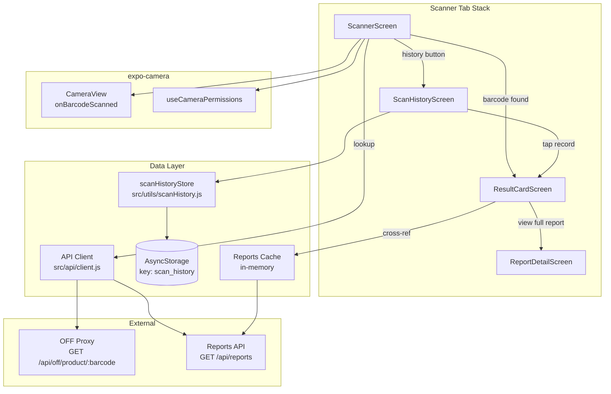

# Design Document: Mobile Barcode Scanner

## Overview

This design adds a barcode scanning feature to the ChoosePure React Native (Expo) mobile app. Users can scan EAN-13 barcodes on food products using the device camera or enter barcodes manually, then view a layered result card combining ChoosePure lab data with Open Food Facts (OFF) nutritional data. A local scan history (AsyncStorage, max 50 records) lets users revisit previously scanned products.

The feature integrates with two existing backend endpoints — `GET /api/off/product/:barcode` (OFF proxy) and `GET /api/reports` (ChoosePure lab reports) — requiring no backend changes. A new "Scan" tab is added to the bottom navigation between Dashboard and Polling, containing a scanner stack: ScannerScreen → ResultCardScreen → ScanHistoryScreen (with nested ReportDetailScreen).

Key technology choice: `expo-camera` v16 with `CameraView` component and `useCameraPermissions` hook. This is the modern Expo approach — `expo-barcode-scanner` is deprecated in favour of the built-in barcode scanning in `expo-camera`. The `CameraView` component supports `onBarcodeScanned` callback with `barcodeScannerSettings` to restrict detection to `ean13` type.

## Architecture



### Key Architectural Decisions

1. **expo-camera CameraView** over deprecated expo-barcode-scanner. CameraView supports `onBarcodeScanned` with `barcodeScannerSettings: { barcodeTypes: ['ean13'] }` to restrict scanning to EAN-13 only. The `useCameraPermissions` hook handles permission state.

2. **Scan history as a pure data module** (`src/utils/scanHistory.js`). All AsyncStorage read/write logic is isolated in pure functions that serialise/deserialise JSON. This makes the module testable without React component rendering.

3. **Reports cached in-memory on ResultCardScreen mount**. The screen fetches `GET /api/reports` once and caches the array. Cross-referencing is a simple `find()` by barcode field. No new context provider needed — the reports list is small and the fetch is fast.

4. **No new backend endpoints**. The OFF proxy and reports API already provide everything needed. The mobile app composes the two data sources client-side.

5. **Scanner tab as a stack navigator** nested inside the bottom tab. This follows the existing pattern (DashboardStackScreen, ProfileStackScreen) in `MainTabs.js`.

6. **Scan pause via state flag**. When a barcode is detected, `onBarcodeScanned` is set to `undefined` (by passing `scanned ? undefined : handleBarcodeScanned`) to prevent duplicate detections. Scanning resumes when the user navigates back or taps "Scan Again".

## Components and Interfaces

### New Files

```
mobile app/src/
├── screens/
│   ├── ScannerScreen.js          # Camera viewfinder + manual entry
│   ├── ResultCardScreen.js       # Layered product result card
│   └── ScanHistoryScreen.js      # List of past scans
├── utils/
│   └── scanHistory.js            # AsyncStorage scan history CRUD
└── components/
    ├── NutriScoreBadge.js        # Colour-coded A-E badge
    ├── NovaGroupLabel.js         # NOVA 1-4 with description
    ├── AdditiveBadge.js          # E-number with risk colour
    └── NutritionTable.js         # Per-100g nutrition facts
```

### Modified Files

```
mobile app/src/navigation/MainTabs.js   # Add Scan tab + ScannerStack
mobile app/package.json                  # Add expo-camera dependency
mobile app/app.json                      # Add expo-camera plugin config
```

### ScannerScreen

The primary scanning interface with two modes: camera scan and manual entry.

```javascript
// Key imports
import { CameraView, useCameraPermissions } from 'expo-camera';
import { Linking } from 'react-native';

// State
const [permission, requestPermission] = useCameraPermissions();
const [scanned, setScanned] = useState(false);
const [manualBarcode, setManualBarcode] = useState('');
const [loading, setLoading] = useState(false);
const [error, setError] = useState(null);

// Camera barcode handler
function handleBarcodeScanned({ type, data }) {
  // type will be 'ean13' since we restrict via barcodeScannerSettings
  if (data.length !== 13 || !/^\d{13}$/.test(data)) return; // extra safety
  setScanned(true);
  lookupProduct(data);
}

// Manual entry validation
function validateBarcode(input) {
  if (!/^\d+$/.test(input)) return { valid: false, error: 'Barcode must contain only numbers' };
  if (input.length !== 13) return { valid: false, error: 'Please enter a valid 13-digit barcode' };
  return { valid: true, error: null };
}

// Product lookup
async function lookupProduct(barcode) {
  setLoading(true);
  setError(null);
  try {
    const res = await apiClient.get(`/api/off/product/${barcode}`);
    if (res.data.found) {
      navigation.navigate('ResultCard', { product: res.data.product, barcode });
    } else {
      setError('Product not found in Open Food Facts database');
    }
  } catch (e) {
    if (e.response?.status === 504) {
      setError('Lookup timed out. Please try again.');
    } else {
      setError('Network error. Please check your connection.');
    }
  } finally {
    setLoading(false);
    setScanned(false);
  }
}
```

**CameraView configuration:**
```jsx
<CameraView
  style={styles.camera}
  facing="back"
  onBarcodeScanned={scanned ? undefined : handleBarcodeScanned}
  barcodeScannerSettings={{ barcodeTypes: ['ean13'] }}
/>
```

**Permission states:**
- `permission === null` → loading spinner
- `permission.granted === false` → show explanation text + "Open Settings" button (`Linking.openSettings()`) + manual entry as primary
- `permission.granted === true` → show camera viewfinder + manual entry below

### ResultCardScreen

Displays the layered product result. Receives `product` (OFF data) and `barcode` via navigation params.

```javascript
// On mount:
// 1. Save to scan history
// 2. Fetch reports list and cross-reference by barcode

const [matchedReport, setMatchedReport] = useState(null);

useEffect(() => {
  saveScanRecord(barcode, product);
  crossReferenceReport(barcode);
}, []);

async function crossReferenceReport(barcode) {
  try {
    const res = await apiClient.get('/api/reports');
    const reports = res.data.reports || res.data || [];
    const match = reports.find(r => r.barcode === barcode);
    if (match) setMatchedReport(match);
  } catch (e) {
    // Silently fail — OFF data still shows
  }
}
```

**Layout (top to bottom):**
1. **ChoosePure Lab Report section** (only if `matchedReport` exists)
   - Product name, purity score (if available), status badges
   - "View Full Report" button → navigates to ReportDetailScreen
2. **Product header** — name, brand, image from OFF
3. **Nutri-Score badge** — colour-coded A-E
4. **NOVA group** — number + descriptive label
5. **Ingredients** — full text
6. **Additives** — list of AdditiveBadge components
7. **Allergens** — visible list
8. **Nutrition facts table** — energy, fat, saturated fat, carbs, sugars, proteins, salt, fibre
9. **Attribution** — "Data from Open Food Facts (openfoodfacts.org) under ODbL licence"

### ScanHistoryScreen

Displays stored scan records sorted by timestamp (most recent first).

```javascript
const [history, setHistory] = useState([]);

useFocusEffect(
  useCallback(() => {
    loadScanHistory().then(setHistory);
  }, [])
);

function handleRecordPress(record) {
  // Re-fetch from OFF proxy using stored barcode
  navigation.navigate('ResultCard', { barcode: record.barcode, product: null });
  // ResultCardScreen will re-fetch if product is null
}

async function handleClearHistory() {
  await clearScanHistory();
  setHistory([]);
}
```

### Scan History Store (`src/utils/scanHistory.js`)

Pure utility module — no React dependencies. All functions are async and operate on AsyncStorage.

```javascript
const SCAN_HISTORY_KEY = 'scan_history';
const MAX_RECORDS = 50;

// Core interface
export async function getScanHistory(): ScanRecord[]
export async function saveScanRecord(barcode, product): void
export async function clearScanHistory(): void

// Internal helpers (exported for testing)
export function serializeScanHistory(records: ScanRecord[]): string
export function deserializeScanHistory(json: string | null): ScanRecord[]
export function addRecord(history: ScanRecord[], newRecord: ScanRecord): ScanRecord[]
```

**`addRecord` logic (pure function):**
1. Check if `barcode` matches the most recent entry (index 0). If so, update its `scannedAt` timestamp instead of adding a duplicate.
2. Otherwise, prepend the new record.
3. If length exceeds 50, remove the last (oldest) entry.

**`deserializeScanHistory` logic (pure function):**
1. If input is `null`, return `[]`.
2. Try `JSON.parse(input)`. If it throws or result is not an array, return `[]`.

### Navigation Integration (MainTabs.js changes)

```javascript
// New imports
import ScannerScreen from '../screens/ScannerScreen';
import ResultCardScreen from '../screens/ResultCardScreen';
import ScanHistoryScreen from '../screens/ScanHistoryScreen';

const ScanStack = createStackNavigator();

function ScannerStackScreen() {
  return (
    <ScanStack.Navigator screenOptions={stackScreenOptions}>
      <ScanStack.Screen name="ScannerHome" component={ScannerScreen} options={{ title: 'Scan Product' }} />
      <ScanStack.Screen name="ResultCard" component={ResultCardScreen} options={{ title: 'Product Details' }} />
      <ScanStack.Screen name="ScanHistory" component={ScanHistoryScreen} options={{ title: 'Scan History' }} />
      <ScanStack.Screen name="ScanReportDetail" component={ReportDetailScreen} options={{ title: 'Lab Report' }} />
    </ScanStack.Navigator>
  );
}

// In MainTabs, insert between Dashboard and Polling:
<Tab.Screen name="Dashboard" component={DashboardStackScreen} />
<Tab.Screen name="Scan" component={ScannerStackScreen} />
<Tab.Screen name="Polling" component={PollingScreen} />
```

**Tab icon:** `📷` (or a barcode icon emoji `📊`). The `TabIcon` function is updated:
```javascript
const icons = { Dashboard: '🏠', Scan: '📷', Polling: '🗳️', Suggestions: '💡', Referral: '🎁', Profile: '👤' };
```

### Reusable Display Components

**NutriScoreBadge** — Maps grade to background colour, renders white bold letter.

```javascript
const NUTRI_COLORS = {
  a: '#1F6B4E', b: '#85BB65', c: '#FFB703', d: '#E67E22', e: '#D62828',
};

export function getNutriScoreColor(grade) {
  if (!grade) return null;
  return NUTRI_COLORS[grade.toLowerCase()] || null;
}
```

**NovaGroupLabel** — Maps group number to descriptive text.

```javascript
const NOVA_LABELS = {
  1: 'Unprocessed or minimally processed',
  2: 'Processed culinary ingredients',
  3: 'Processed foods',
  4: 'Ultra-processed food and drink products',
};

export function getNovaLabel(group) {
  if (!group) return null;
  return NOVA_LABELS[group] || null;
}
```

**AdditiveBadge** — Maps risk level to background/text colour pair.

```javascript
const ADDITIVE_COLORS = {
  low:      { bg: '#E8F5E9', text: '#2E7D32' },
  moderate: { bg: '#FFF8E1', text: '#E65100' },
  high:     { bg: '#FFEBEE', text: '#C62828' },
  unknown:  { bg: '#F5F5F5', text: '#6B6B6B' },
};

export function getAdditiveColors(risk) {
  return ADDITIVE_COLORS[risk] || ADDITIVE_COLORS.unknown;
}
```

**NutritionTable** — Renders a table of per-100g values: energy (kcal), fat, saturated fat, carbohydrates, sugars, proteins, salt, fibre.

### expo-camera Plugin Configuration (app.json)

```json
{
  "expo": {
    "plugins": [
      [
        "expo-camera",
        {
          "cameraPermission": "Allow ChoosePure to access your camera to scan product barcodes",
          "recordAudioAndroid": false
        }
      ]
    ]
  }
}
```

### New Dependency

```json
{
  "dependencies": {
    "expo-camera": "~16.0.0"
  }
}
```

This is compatible with Expo SDK 52. Since the app already uses `expo-dev-client` for `react-native-razorpay`, adding `expo-camera` (which has native modules) requires no workflow change — the custom dev client build already supports native modules.

## Data Models

### ScanRecord (AsyncStorage)

```typescript
interface ScanRecord {
  barcode: string;           // 13-digit EAN-13
  productName: string;       // from OFF data
  brand: string;             // from OFF data
  nutriScore: string | null; // 'a'-'e' or null
  novaGroup: number | null;  // 1-4 or null
  imageUrl: string | null;   // product image URL
  hasChoosePureReport: boolean; // whether a matching report was found
  scannedAt: string;         // ISO 8601 timestamp
}
```

**Storage format:** JSON array in AsyncStorage under key `scan_history`. Maximum 50 records, sorted by `scannedAt` descending (most recent first).

### OFF Product (from proxy — existing shape)

```typescript
interface OFFProduct {
  name: string;
  brand: string;
  barcode: string;
  nutriScore: 'a' | 'b' | 'c' | 'd' | 'e' | null;
  novaGroup: 1 | 2 | 3 | 4 | null;
  ingredients: string;
  additives: Array<{ code: string; name: string; risk: 'low' | 'moderate' | 'high' | 'unknown' }>;
  allergens: string;
  nutritionPer100g: {
    energy_kcal: number;
    fat: number;
    saturated_fat: number;
    carbohydrates: number;
    sugars: number;
    proteins: number;
    salt: number;
    fiber: number;
  };
  ecoScore: string | null;
  imageUrl: string | null;
}
```

### ChoosePure Report (existing shape — relevant fields)

```typescript
interface ReportCard {
  _id: string;
  productName: string;
  brandName: string;
  barcode?: string;          // optional EAN-13, used for cross-referencing
  purityScore?: number;
  statusBadges: string[];
  imageUrl: string;
}
```

### Barcode Validation Result

```typescript
interface BarcodeValidation {
  valid: boolean;
  error: string | null;  // null when valid
}
```


## Correctness Properties

*A property is a characteristic or behavior that should hold true across all valid executions of a system — essentially, a formal statement about what the system should do. Properties serve as the bridge between human-readable specifications and machine-verifiable correctness guarantees.*

### Property 1: Barcode validation correctness

*For any* string input, the `validateBarcode` function SHALL return `{ valid: true, error: null }` if and only if the string is exactly 13 characters long and consists entirely of digit characters. For strings containing non-digit characters, it SHALL return the error "Barcode must contain only numbers". For all-digit strings whose length is not 13, it SHALL return the error "Please enter a valid 13-digit barcode".

**Validates: Requirements 1.3, 2.2, 2.3, 2.4**

### Property 2: Nutri-Score colour mapping

*For any* valid Nutri-Score grade in {a, b, c, d, e} (case-insensitive), the `getNutriScoreColor` function SHALL return the correct background colour: A→#1F6B4E, B→#85BB65, C→#FFB703, D→#E67E22, E→#D62828. For null, undefined, or any other value, it SHALL return null.

**Validates: Requirements 5.2**

### Property 3: NOVA group label mapping

*For any* valid NOVA group in {1, 2, 3, 4}, the `getNovaLabel` function SHALL return the correct descriptive label: 1→"Unprocessed or minimally processed", 2→"Processed culinary ingredients", 3→"Processed foods", 4→"Ultra-processed food and drink products". For null, undefined, or any other value, it SHALL return null.

**Validates: Requirements 5.3**

### Property 4: Additive risk colour mapping

*For any* additive risk level in {low, moderate, high, unknown}, the `getAdditiveColors` function SHALL return the correct background/text colour pair: low→#E8F5E9/#2E7D32, moderate→#FFF8E1/#E65100, high→#FFEBEE/#C62828, unknown→#F5F5F5/#6B6B6B. For any unrecognised risk value, it SHALL default to the unknown colour pair.

**Validates: Requirements 5.5**

### Property 5: Report cross-reference by barcode

*For any* array of report objects (each with an optional `barcode` field) and any 13-digit barcode string, the cross-reference function SHALL return the first report whose `barcode` field exactly matches the search barcode, or null if no report matches.

**Validates: Requirements 4.1**

### Property 6: ScanRecord creation from OFF product

*For any* valid OFF product object and any barcode string, the `createScanRecord` function SHALL produce a ScanRecord containing all required fields: `barcode`, `productName` (from product.name), `brand` (from product.brand), `nutriScore`, `novaGroup`, `imageUrl`, `hasChoosePureReport`, and a valid ISO 8601 `scannedAt` timestamp.

**Validates: Requirements 6.1**

### Property 7: History cap and deduplication

*For any* scan history array (length 0–50) and any new ScanRecord, the `addRecord` function SHALL: (a) if the new record's barcode matches the most recent entry's barcode, update the most recent entry's timestamp without changing the array length; (b) otherwise, prepend the new record and, if the resulting length exceeds 50, remove the oldest (last) entry. The result SHALL never exceed 50 records.

**Validates: Requirements 6.2, 9.4**

### Property 8: History sort order invariant

*For any* scan history array produced by `addRecord`, the records SHALL be sorted by `scannedAt` in descending order (most recent first). That is, for every consecutive pair of records at indices i and i+1, `records[i].scannedAt >= records[i+1].scannedAt`.

**Validates: Requirements 6.3**

### Property 9: Scan history JSON round-trip

*For any* valid array of ScanRecord objects, `deserializeScanHistory(serializeScanHistory(records))` SHALL produce an array deeply equal to the original.

**Validates: Requirements 10.2**

### Property 10: Invalid JSON deserializes to empty array

*For any* string that is not valid JSON, or for null, the `deserializeScanHistory` function SHALL return an empty array without throwing an error.

**Validates: Requirements 10.3**

## Error Handling

### Scanner Screen Errors

| Scenario | Detection | User Feedback | Recovery |
|----------|-----------|---------------|----------|
| Camera permission denied | `permission.granted === false` | "Camera access is needed to scan barcodes. You can still enter barcodes manually." + "Open Settings" button | Manual entry available; settings button calls `Linking.openSettings()` |
| No camera on device | `CameraView.isAvailableAsync() === false` | Camera viewfinder hidden; manual entry shown as primary | Manual entry only |
| OFF product not found | `res.data.found === false` | "Product not found in Open Food Facts database" + "Scan Another" button | Reset scanner state |
| OFF proxy timeout (504) | `error.response?.status === 504` | "Lookup timed out. Please try again." + "Retry" button | Retry with same barcode |
| Network error | No `error.response` (Axios network error) | "Network error. Please check your connection." + "Retry" button | Retry with same barcode |
| Invalid manual barcode (non-numeric) | `validateBarcode` returns error | "Barcode must contain only numbers" inline below input | User corrects input |
| Invalid manual barcode (wrong length) | `validateBarcode` returns error | "Please enter a valid 13-digit barcode" inline below input | User corrects input |
| Non-EAN-13 camera detection | `barcodeScannerSettings` restricts to `ean13` | Silent — ignored by CameraView config | Continues scanning |

### Result Card Screen Errors

| Scenario | Detection | User Feedback | Recovery |
|----------|-----------|---------------|----------|
| Reports API failure | `catch` on `apiClient.get('/api/reports')` | Silent — ChoosePure section not shown, OFF data still displayed | No action needed |
| Product image fails to load | `Image` `onError` callback | Placeholder "No Image" view (same pattern as DashboardScreen) | None |
| Re-fetch on history tap fails | Network/API error during re-fetch | Same error handling as ScannerScreen (error message + retry) | Retry button |

### Scan History Errors

| Scenario | Detection | User Feedback | Recovery |
|----------|-----------|---------------|----------|
| AsyncStorage read fails | `catch` on `AsyncStorage.getItem` | Empty history shown (graceful degradation) | Pull-to-refresh |
| AsyncStorage write fails | `catch` on `AsyncStorage.setItem` | Silent — scan still navigates to result, history just not saved | Next scan will retry |
| Corrupted JSON in storage | `JSON.parse` throws or result is not array | Treated as empty history (per Requirement 10.3) | New scans overwrite corrupted data |

### Offline Handling

The existing `OfflineBanner` component (from `src/components/OfflineBanner.js`) is reused on the ScannerScreen. When offline:
- The banner displays "No internet connection" at the top
- The "Scan" / "Look Up" buttons are disabled (greyed out) since product lookup requires network
- Camera viewfinder remains active (scanning still works, but lookup will fail with a network error message if attempted)
- Scan history remains accessible (local AsyncStorage reads work offline)

### Loading States

- **ScannerScreen**: Full-screen `ActivityIndicator` overlay during product lookup, with the barcode displayed below ("Looking up 8901262011112...")
- **ResultCardScreen**: `ActivityIndicator` while fetching reports for cross-reference (OFF data renders immediately since it's passed via navigation params)
- **ScanHistoryScreen**: `ActivityIndicator` while loading history from AsyncStorage (typically instant)

## Testing Strategy

### Unit Tests (Jest + React Native Testing Library)

Focus on specific examples, edge cases, and component rendering:

**ScannerScreen:**
- Renders camera viewfinder when permission is granted
- Shows permission explanation and settings button when permission is denied
- Shows manual entry as primary when permission is denied
- Displays loading indicator during lookup
- Shows "Product not found" message on `found: false` response
- Shows timeout message on 504 response
- Shows network error message on network failure
- Navigates to ResultCard on successful lookup
- Disables scan/lookup buttons when offline

**ResultCardScreen:**
- Renders ChoosePure section when matched report exists
- Hides ChoosePure section when no report matches
- Renders all OFF data sections (name, brand, image, ingredients, allergens, nutrition table)
- Renders Nutri-Score badge with correct colour
- Renders NOVA group with correct label
- Renders additive badges with correct risk colours
- Displays attribution text
- "View Full Report" button navigates to ReportDetailScreen with correct ID

**ScanHistoryScreen:**
- Renders list of scan records
- Shows empty state message when no records
- Tapping a record navigates to ResultCard with barcode
- Clear history button removes all records
- Records displayed in descending timestamp order

**Navigation:**
- Scan tab appears between Dashboard and Polling
- Scan tab has correct icon and "Scan" label
- ScannerStack contains all four screens

**Brand theming:**
- Screens use primary colour #1F6B4E for buttons/headers
- Screens use background colour #FAFAF7
- Text elements use Inter font family

### Property-Based Tests (fast-check)

Using the `fast-check` library (already in devDependencies). Each property test runs a minimum of **100 iterations**.

**Test file:** `mobile app/src/__tests__/scanner.property.test.js`

1. **Property 1** — Generate random strings (empty, short, long, numeric, alphanumeric, special chars) → verify `validateBarcode` returns correct result based on length and character content.
   - Tag: `Feature: mobile-barcode-scanner, Property 1: Barcode validation correctness`

2. **Property 2** — Generate random Nutri-Score grades from {a,b,c,d,e,null,undefined,'x','Z'} → verify `getNutriScoreColor` returns correct colour or null.
   - Tag: `Feature: mobile-barcode-scanner, Property 2: Nutri-Score colour mapping`

3. **Property 3** — Generate random NOVA groups from {1,2,3,4,null,undefined,0,5,99} → verify `getNovaLabel` returns correct label or null.
   - Tag: `Feature: mobile-barcode-scanner, Property 3: NOVA group label mapping`

4. **Property 4** — Generate random risk levels from {low,moderate,high,unknown} plus random invalid strings → verify `getAdditiveColors` returns correct colour pair or defaults to unknown.
   - Tag: `Feature: mobile-barcode-scanner, Property 4: Additive risk colour mapping`

5. **Property 5** — Generate random arrays of report objects (0–20 reports, some with barcode fields, some without) and random 13-digit barcodes → verify cross-reference returns correct match or null.
   - Tag: `Feature: mobile-barcode-scanner, Property 5: Report cross-reference by barcode`

6. **Property 6** — Generate random OFF product objects with varying field values → verify `createScanRecord` output contains all required fields correctly mapped.
   - Tag: `Feature: mobile-barcode-scanner, Property 6: ScanRecord creation from OFF product`

7. **Property 7** — Generate random histories (0–50 records) and new records (some with barcode matching most recent, some not) → verify `addRecord` maintains cap of 50 and handles dedup correctly.
   - Tag: `Feature: mobile-barcode-scanner, Property 7: History cap and deduplication`

8. **Property 8** — Generate random sequences of `addRecord` calls → verify resulting array is always sorted by `scannedAt` descending.
   - Tag: `Feature: mobile-barcode-scanner, Property 8: History sort order invariant`

9. **Property 9** — Generate random arrays of ScanRecord objects → verify `deserializeScanHistory(serializeScanHistory(records))` produces deeply equal result.
   - Tag: `Feature: mobile-barcode-scanner, Property 9: Scan history JSON round-trip`

10. **Property 10** — Generate random non-JSON strings, null, undefined, empty string, partial JSON → verify `deserializeScanHistory` returns `[]` without throwing.
    - Tag: `Feature: mobile-barcode-scanner, Property 10: Invalid JSON deserializes to empty array`

### Integration Tests

- End-to-end scan flow: camera detects barcode → lookup → result card displays → history saved
- Manual entry flow: type barcode → submit → lookup → result card
- History re-fetch: tap history record → re-fetches from OFF proxy → displays result
- Cross-reference: scan barcode that matches a ChoosePure report → ChoosePure section appears
- Offline: scan while offline → error message → go online → retry succeeds

### Key Dependencies

| Package | Version | Purpose |
|---------|---------|---------|
| `expo-camera` | ~16.0.0 | CameraView for barcode scanning (replaces deprecated expo-barcode-scanner) |
| `@react-native-async-storage/async-storage` | 1.23.1 | Scan history persistence (already installed) |
| `axios` | ^1.7.0 | HTTP client for OFF proxy calls (already installed) |
| `@react-navigation/stack` | ^7.0.0 | Scanner tab stack navigator (already installed) |
| `@react-native-community/netinfo` | 11.4.1 | Offline detection for scanner screen (already installed) |
| `fast-check` | ^3.22.0 | Property-based testing (already in devDependencies) |
