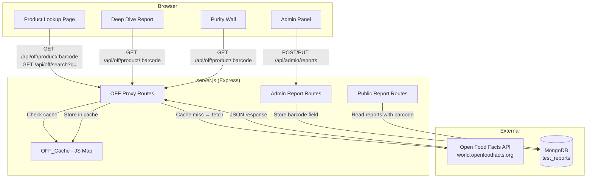

# Design Document: Open Food Facts Integration

## Overview

This design adds an Open Food Facts (OFF) integration layer to the ChoosePure platform. The integration consists of:

1. **Backend proxy endpoints** (`/api/off/product/:barcode` and `/api/off/search`) in `server.js` that forward requests to the OFF public API, enforce a 3-second timeout, and cache responses in an in-memory JS `Map` with 24-hour TTL.
2. **A new Product Lookup page** (`product-lookup.html`) served at `/product-lookup` where users can search by barcode or product name without authentication.
3. **Report detail enrichment** on `deep-dive.html` — a new "Supplemental Data from Open Food Facts" section rendered below lab findings when a matching barcode exists.
4. **Purity Wall enhancements** on `purity-wall.html` — Nutri-Score badges on report cards plus Nutri-Score and NOVA group filter controls.
5. **Admin barcode field** — an optional EAN-13 input on the report creation/edit form in `admin.html`, stored in the `test_reports` MongoDB collection.

ChoosePure lab data always takes priority; OFF data is supplemental. All OFF data is attributed per ODbL licence requirements.

## Architecture



### Request Flow

1. Frontend calls `/api/off/product/:barcode` or `/api/off/search?q=term`.
2. Proxy validates input (barcode format or query length).
3. Proxy checks `OFF_Cache` (JS `Map`). If a non-expired entry exists, return it immediately.
4. On cache miss, proxy fetches from OFF API with a 3-second `AbortController` timeout and `User-Agent: ChoosePure/1.0 (choosepure.in)`.
5. On success, proxy normalises the response, stores it in cache with a timestamp, and returns it.
6. On timeout → 504. On upstream error → 502. On not-found → `{ found: false }` (also cached).

## Components and Interfaces

### 1. OFF Cache Module (in-memory)

A simple cache object at the top of `server.js`, using a JS `Map` with timestamp-based TTL.

```javascript
// OFF API Cache — simple in-memory Map with 24h TTL
const offCache = new Map();
const OFF_CACHE_TTL = 24 * 60 * 60 * 1000; // 24 hours in ms

function offCacheGet(key) {
    const entry = offCache.get(key);
    if (!entry) return null;
    if (Date.now() - entry.timestamp > OFF_CACHE_TTL) {
        offCache.delete(key);
        return null;
    }
    return entry.data;
}

function offCacheSet(key, data) {
    offCache.set(key, { data, timestamp: Date.now() });
}
```

### 2. OFF Proxy Routes

#### `GET /api/off/product/:barcode`

| Aspect | Detail |
|---|---|
| Auth | None (public) |
| Validation | `:barcode` must be exactly 13 digits (`/^\d{13}$/`) |
| Upstream URL | `https://world.openfoodfacts.org/api/v2/product/{barcode}.json` |
| Timeout | 3 000 ms via `AbortController` |
| User-Agent | `ChoosePure/1.0 (choosepure.in)` |
| Cache key | `product:{barcode}` |

**Success response (200):**

```json
{
    "found": true,
    "product": {
        "name": "Amul Taaza Toned Milk",
        "brand": "Amul",
        "barcode": "8901262011112",
        "nutriScore": "b",
        "novaGroup": 1,
        "ingredients": "Toned milk",
        "additives": [
            { "code": "E330", "name": "Citric acid", "risk": "low" }
        ],
        "allergens": "milk",
        "nutritionPer100g": {
            "energy_kcal": 50,
            "fat": 1.5,
            "saturated_fat": 1.0,
            "carbohydrates": 5.0,
            "sugars": 5.0,
            "proteins": 3.3,
            "salt": 0.1,
            "fiber": 0
        },
        "ecoScore": "b",
        "imageUrl": "https://images.openfoodfacts.org/images/products/..."
    }
}
```

**Not-found response (200):**

```json
{ "found": false }
```

**Error responses:**

| Status | Condition |
|---|---|
| 400 | Barcode not 13 digits |
| 502 | OFF API returned non-200 |
| 504 | OFF API did not respond within 3 s |

#### `GET /api/off/search?q=term`

| Aspect | Detail |
|---|---|
| Auth | None (public) |
| Validation | `q` required, minimum 2 characters |
| Upstream URL | `https://world.openfoodfacts.org/cgi/search.pl?search_terms={q}&json=1&page_size=24` |
| Timeout | 3 000 ms via `AbortController` |
| User-Agent | `ChoosePure/1.0 (choosepure.in)` |
| Cache key | `search:{normalised_query}` (lowercased, trimmed) |

**Success response (200):**

```json
{
    "products": [
        {
            "name": "Amul Taaza Toned Milk",
            "brand": "Amul",
            "barcode": "8901262011112",
            "nutriScore": "b",
            "novaGroup": 1,
            "imageUrl": "https://images.openfoodfacts.org/..."
        }
    ]
}
```

**Error responses:**

| Status | Condition |
|---|---|
| 400 | `q` missing or fewer than 2 characters |
| 502 | OFF API returned non-200 |
| 504 | OFF API did not respond within 3 s |

### 3. Product Lookup Page (`product-lookup.html`)

A new standalone HTML page following the existing ChoosePure design system (same header, footer, fonts, and colour palette as `purity-wall.html`).

**Layout:**
- Header with navigation (same as purity-wall)
- Search section: single input field with placeholder "Enter barcode or product name", submit button
- Results area: either a single product detail view (barcode lookup) or a grid of product cards (text search)
- Product detail view: name, brand, image, Nutri-Score badge, NOVA group label, ingredients, additive badges, allergens, nutrition facts table, and a "View ChoosePure Lab Report" link when a matching report exists
- OFF attribution footer on every product detail view
- Site footer (same as purity-wall)

**Route:** `GET /product-lookup` → `res.sendFile('product-lookup.html')`

**Client-side logic:**
- Detect input type: if input matches `/^\d{13}$/` → barcode lookup, else → text search
- Barcode lookup calls `GET /api/off/product/:barcode`
- Text search calls `GET /api/off/search?q=term`
- On product card click from search results, call barcode lookup for that product's barcode and render detail view
- Cross-reference with ChoosePure reports: call `GET /api/reports` and match by barcode field; if matched, show "View ChoosePure Lab Report" link pointing to `/deep-dive?id={reportId}`

### 4. Nutri-Score Badge Component

A reusable CSS class + JS helper used across Product Lookup, Deep Dive, and Purity Wall pages.

**Colour mapping:**

| Grade | Background | Text |
|---|---|---|
| A | #1F6B4E (dark green) | white, bold |
| B | #85BB65 (light green) | white, bold |
| C | #FFB703 (yellow) | white, bold |
| D | #E67E22 (orange) | white, bold |
| E | #D62828 (red) | white, bold |
| null | Not rendered | — |

**HTML pattern:**
```html
<span class="nutri-score-badge nutri-score-{grade}">{GRADE}</span>
```

### 5. NOVA Group Display Component

**Label mapping:**

| Group | Label |
|---|---|
| 1 | Unprocessed or minimally processed |
| 2 | Processed culinary ingredients |
| 3 | Processed foods |
| 4 | Ultra-processed food and drink products |
| null | Not rendered |

**HTML pattern:**
```html
<span class="nova-group">NOVA <strong>{group}</strong> — {label}</span>
```

### 6. Additive Badge Component

**Risk-level colour mapping:**

| Risk | Background | Text colour |
|---|---|---|
| low | #E8F5E9 | #2E7D32 |
| moderate | #FFF8E1 | #E65100 |
| high | #FFEBEE | #C62828 |
| unknown | #F5F5F5 | #6B6B6B |

**HTML pattern:**
```html
<span class="additive-badge additive-{risk}">{E-number} — {name}</span>
```

### 7. Report Detail Enrichment (`deep-dive.html`)

After the existing report renders, the page checks if the report document has a `barcode` field. If so, it calls `GET /api/off/product/:barcode`. On success (`found: true`), it appends an "Open Food Facts Data" section containing:
- Section heading: "Supplemental Data from Open Food Facts"
- Nutri-Score badge
- NOVA group with label
- Ingredients list
- Additive badges
- Allergens list
- OFF attribution text

If the proxy returns `{ found: false }` or any error, the section is silently omitted.

### 8. Purity Wall Enhancements (`purity-wall.html`)

**Nutri-Score badges on cards:**
- After report cards load, for each report with a `barcode` field, fetch OFF data via `/api/off/product/:barcode`.
- Display a small Nutri-Score badge on the card image area, positioned at `bottom: 12px; left: 12px` (the existing purity score badge is at `bottom: 12px; right: 12px`).
- Store fetched OFF data in a client-side map for filtering.

**Filter controls:**
- Add a filter bar below the welcome banner with:
  - Nutri-Score dropdown: All, A, B, C, D, E
  - NOVA group dropdown: All, 1, 2, 3, 4
- Filtering is client-side: hide/show cards based on cached OFF data.
- When both filters are active, both must match (AND logic).
- Empty state: "No products match the selected filters".

### 9. Admin Barcode Field (`admin.html`)

Add an optional barcode input to the report creation/edit form:
- Field label: "Barcode (EAN-13)"
- Input type: text, pattern `[0-9]{13}`, maxlength 13
- Validation: if non-empty, must be exactly 13 digits; otherwise allow empty
- Positioned after the existing "Status Badges" field in the form grid
- On submit, include `barcode` in the POST/PUT request body
- On edit, pre-populate the barcode field from the report document

## Data Models

### Test Report Document (MongoDB `test_reports` collection)

Existing fields remain unchanged. New field added:

```javascript
{
    // ... existing fields ...
    productName: String,       // required
    brandName: String,         // required
    category: String,          // required
    imageUrl: String,          // required
    purityScore: Number,       // required, 0-100
    testParameters: Array,     // required
    expertCommentary: String,
    statusBadges: Array,
    batchCode: String,
    shelfLife: String,
    testDate: Date,
    methodology: String,
    reportUrl: String,
    published: Boolean,
    createdAt: Date,
    updatedAt: Date,

    // NEW FIELD
    barcode: String | null     // optional, EAN-13 (13 digits) or null
}
```

### OFF Product Response (normalised by proxy)

```typescript
interface OFFProduct {
    name: string;
    brand: string;
    barcode: string;
    nutriScore: 'a' | 'b' | 'c' | 'd' | 'e' | null;
    novaGroup: 1 | 2 | 3 | 4 | null;
    ingredients: string;
    additives: OFFAdditive[];
    allergens: string;
    nutritionPer100g: OFFNutrition;
    ecoScore: string | null;
    imageUrl: string | null;
}

interface OFFAdditive {
    code: string;    // e.g. "E330"
    name: string;    // e.g. "Citric acid"
    risk: 'low' | 'moderate' | 'high' | 'unknown';
}

interface OFFNutrition {
    energy_kcal: number;
    fat: number;
    saturated_fat: number;
    carbohydrates: number;
    sugars: number;
    proteins: number;
    salt: number;
    fiber: number;
}
```

### OFF Search Result (normalised by proxy)

```typescript
interface OFFSearchProduct {
    name: string;
    brand: string;
    barcode: string;
    nutriScore: 'a' | 'b' | 'c' | 'd' | 'e' | null;
    novaGroup: 1 | 2 | 3 | 4 | null;
    imageUrl: string | null;
}
```

### OFF Cache Entry

```typescript
interface OFFCacheEntry {
    data: any;          // The normalised response object
    timestamp: number;  // Date.now() when cached
}
```


## Correctness Properties

*A property is a characteristic or behavior that should hold true across all valid executions of a system — essentially, a formal statement about what the system should do. Properties serve as the bridge between human-readable specifications and machine-verifiable correctness guarantees.*

### Property 1: Barcode lookup normalisation

*For any* valid 13-digit barcode and any well-formed OFF API product response (mocked), the proxy normalisation function SHALL return an object containing all required fields: `name`, `brand`, `barcode`, `nutriScore`, `novaGroup`, `ingredients`, `additives`, `allergens`, `nutritionPer100g`, `ecoScore`, and `imageUrl`, with values correctly mapped from the raw OFF response.

**Validates: Requirements 1.1, 1.3**

### Property 2: Invalid barcode rejection

*For any* string that does not match the pattern `/^\d{13}$/` (including strings that are too short, too long, contain non-digit characters, or are empty), the barcode validation function SHALL reject the input, returning a 400-level error.

**Validates: Requirements 1.7, 12.4**

### Property 3: Search result normalisation

*For any* search query string of at least 2 characters and any well-formed OFF search API response array (mocked), the proxy normalisation function SHALL return an array where each element contains exactly the fields: `name`, `brand`, `barcode`, `nutriScore`, `novaGroup`, and `imageUrl`, with values correctly mapped from the raw OFF response, and the array length SHALL not exceed 24.

**Validates: Requirements 2.1, 2.2, 2.3**

### Property 4: Cache round-trip

*For any* cache key (barcode or normalised search query) and any response data, storing the data in the OFF cache and then immediately retrieving it with the same key SHALL return the original data unchanged.

**Validates: Requirements 3.1, 3.2, 3.4**

### Property 5: Cache TTL expiry

*For any* cache entry whose timestamp is older than 24 hours (86 400 000 ms), retrieving that entry from the OFF cache SHALL return null (cache miss), regardless of the key or stored data.

**Validates: Requirements 3.3**

### Property 6: Input type classification

*For any* input string, the search input classification function SHALL route 13-digit numeric strings to the barcode lookup endpoint and all other strings of at least 2 characters to the text search endpoint. Strings shorter than 2 characters that are not 13-digit barcodes SHALL be treated as invalid.

**Validates: Requirements 4.3, 4.4**

### Property 7: Nutri-Score colour mapping

*For any* valid Nutri-Score grade in {a, b, c, d, e}, the Nutri-Score colour mapping function SHALL return the correct background colour (A→#1F6B4E, B→#85BB65, C→#FFB703, D→#E67E22, E→#D62828). For null or undefined grades, the function SHALL indicate that no badge should be rendered.

**Validates: Requirements 5.1, 5.2, 5.3, 5.4, 5.5, 5.6, 5.7**

### Property 8: NOVA group label mapping

*For any* valid NOVA group in {1, 2, 3, 4}, the NOVA label mapping function SHALL return the correct descriptive label (1→"Unprocessed or minimally processed", 2→"Processed culinary ingredients", 3→"Processed foods", 4→"Ultra-processed food and drink products"). For null or undefined groups, the function SHALL indicate that no element should be rendered.

**Validates: Requirements 6.1, 6.2, 6.3, 6.4, 6.5, 6.6**

### Property 9: Combined Nutri-Score and NOVA filtering

*For any* set of report cards (each with optional `nutriScore` and `novaGroup` values) and any combination of Nutri-Score filter (All/A/B/C/D/E) and NOVA group filter (All/1/2/3/4), the filter function SHALL return only cards where both filter criteria match (AND logic). When a filter is set to "All", that dimension SHALL impose no constraint. The result set SHALL be a subset of the input set.

**Validates: Requirements 9.3, 9.4, 9.5, 9.6, 9.7**

### Property 10: Additive risk colour mapping

*For any* additive risk level in {low, moderate, high, unknown}, the additive colour mapping function SHALL return the correct background and text colours (low→#E8F5E9/#2E7D32, moderate→#FFF8E1/#E65100, high→#FFEBEE/#C62828, unknown→#F5F5F5/#6B6B6B).

**Validates: Requirements 11.1, 11.2, 11.3, 11.4, 11.5**

## Error Handling

### Backend Proxy Errors

| Scenario | HTTP Status | Response Body | User Impact |
|---|---|---|---|
| Invalid barcode format | 400 | `{ success: false, message: "Invalid barcode format. Must be exactly 13 digits." }` | Search input shows validation error |
| Search query too short | 400 | `{ success: false, message: "Search query must be at least 2 characters." }` | Search input shows validation error |
| Missing search query | 400 | `{ success: false, message: "Query parameter 'q' is required." }` | Search input shows validation error |
| OFF API timeout (3s) | 504 | `{ success: false, message: "Open Food Facts API timed out." }` | Product Lookup shows "Service temporarily unavailable"; Deep Dive and Purity Wall silently omit OFF data |
| OFF API non-200 response | 502 | `{ success: false, message: "Open Food Facts API error." }` | Same as timeout |
| OFF product not found | 200 | `{ found: false }` | Product Lookup shows "Product not found in Open Food Facts database"; Deep Dive silently omits OFF section |
| Database not connected | 500 | `{ success: false, message: "Database not connected" }` | Standard server error |

### Frontend Error Handling

- **Product Lookup page**: Shows user-friendly error messages for 400 errors. For 502/504 errors, shows "Service temporarily unavailable, please try again later." For `{ found: false }`, shows "Product not found in Open Food Facts database."
- **Deep Dive page**: Silently omits the OFF data section on any error (404, timeout, upstream failure). No error message shown to user.
- **Purity Wall**: Silently omits Nutri-Score badges for reports where OFF data fetch fails. Filter controls still work — cards without OFF data are excluded from Nutri-Score/NOVA filters (treated as not matching any specific grade/group).

### Admin Form Validation

- Barcode field: client-side validation via `pattern="[0-9]{13}"` and `maxlength="13"`. If non-empty and invalid, form submission is prevented with inline error "Barcode must be exactly 13 digits."
- Server-side: the existing report creation endpoint validates barcode format if provided; rejects with 400 if invalid.

## Testing Strategy

### Property-Based Tests

Use [fast-check](https://github.com/dubzzz/fast-check) as the property-based testing library (JavaScript, well-maintained, works with any test runner).

Each property test runs a minimum of **100 iterations** with randomly generated inputs.

**Test file:** `tests/off-integration.property.test.js`

Tests to implement (one per correctness property):

1. **Property 1** — Generate random OFF API response objects, pass through `normaliseProduct()`, verify all required fields present and correctly mapped.
   - Tag: `Feature: open-food-facts, Property 1: Barcode lookup normalisation`

2. **Property 2** — Generate random strings that don't match `/^\d{13}$/`, pass through `isValidBarcode()`, verify all return false.
   - Tag: `Feature: open-food-facts, Property 2: Invalid barcode rejection`

3. **Property 3** — Generate random OFF search response arrays, pass through `normaliseSearchResults()`, verify each element has required fields and array length ≤ 24.
   - Tag: `Feature: open-food-facts, Property 3: Search result normalisation`

4. **Property 4** — Generate random key/value pairs, store in cache, retrieve immediately, verify equality.
   - Tag: `Feature: open-food-facts, Property 4: Cache round-trip`

5. **Property 5** — Generate random cache entries with timestamps > 24h ago, verify retrieval returns null.
   - Tag: `Feature: open-food-facts, Property 5: Cache TTL expiry`

6. **Property 6** — Generate random strings, pass through `classifySearchInput()`, verify 13-digit numerics → barcode, others ≥ 2 chars → search, others → invalid.
   - Tag: `Feature: open-food-facts, Property 6: Input type classification`

7. **Property 7** — For each grade in {a,b,c,d,e,null}, verify `getNutriScoreColor()` returns correct colour or null.
   - Tag: `Feature: open-food-facts, Property 7: Nutri-Score colour mapping`

8. **Property 8** — For each group in {1,2,3,4,null}, verify `getNovaLabel()` returns correct label or null.
   - Tag: `Feature: open-food-facts, Property 8: NOVA group label mapping`

9. **Property 9** — Generate random arrays of report card objects with random nutriScore/novaGroup values, apply random filter combinations, verify result is correct subset.
   - Tag: `Feature: open-food-facts, Property 9: Combined Nutri-Score and NOVA filtering`

10. **Property 10** — For each risk in {low,moderate,high,unknown}, verify `getAdditiveColors()` returns correct bg/text colours.
    - Tag: `Feature: open-food-facts, Property 10: Additive risk colour mapping`

### Unit Tests (Example-Based)

**Test file:** `tests/off-integration.test.js`

- User-Agent header is set to `ChoosePure/1.0 (choosepure.in)` on outgoing requests
- OFF API not-found response returns `{ found: false }` with 200
- OFF API timeout returns 504
- OFF API non-200 returns 502
- Missing `q` parameter returns 400
- Search query shorter than 2 characters returns 400
- `{ found: false }` responses are cached (subsequent request returns cached not-found)
- Product Lookup page accessible at `/product-lookup` without auth (200 response)
- Admin report creation stores barcode in MongoDB document
- Admin report creation without barcode stores null barcode
- Report detail page renders OFF section when barcode and OFF data exist
- Report detail page omits OFF section on OFF API failure
- OFF attribution text and link present on product detail views

### Integration Tests

- End-to-end: search for a known product by barcode, verify full response structure
- End-to-end: text search, verify response array structure
- Purity Wall loads with Nutri-Score badges for reports that have barcodes
- Filter controls correctly show/hide report cards
