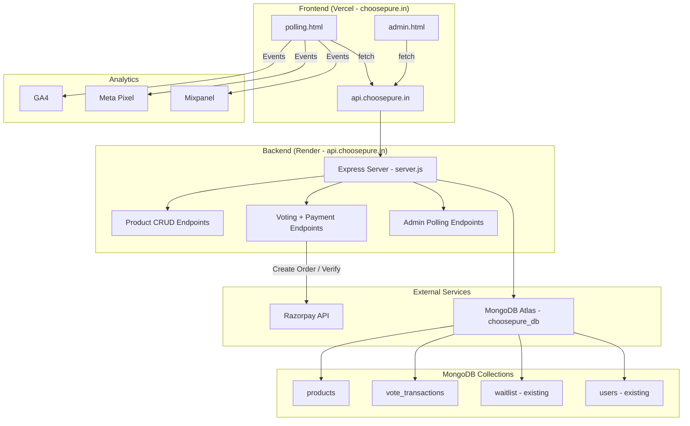
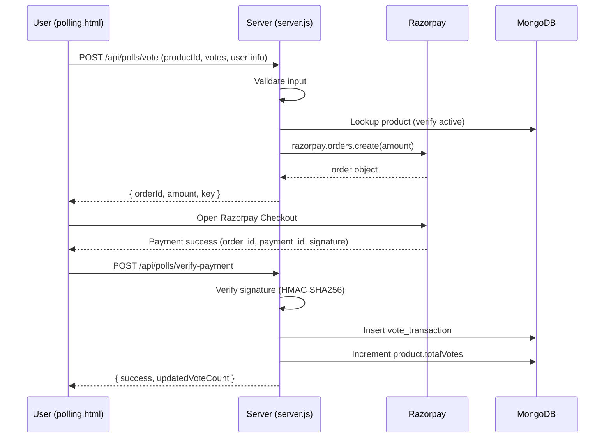

# Design Document: Product Polling and Payment Gateway

## Overview

This feature adds product polling (voting) and Razorpay payment processing to the ChoosePure platform. Admins create products via the existing admin panel, users vote on a new public polling page (`polling.html`), and votes are recorded after successful Razorpay payment. The system extends the existing Node.js/Express backend (`server.js`) with new API endpoints, adds two new MongoDB collections (`products` and `vote_transactions`), and introduces a new static HTML page for the public-facing polling experience.

The architecture follows the existing patterns: static HTML pages on Vercel calling API endpoints on the Express server hosted on Render, with MongoDB Atlas for persistence.

## Architecture



### Request Flow: Vote + Payment



## Components and Interfaces

### Backend API Endpoints (added to server.js)

| Method | Endpoint | Auth | Description |
|--------|----------|------|-------------|
| GET | `/api/polls/products` | Public | List active products sorted by totalVotes desc |
| POST | `/api/admin/polls/products` | Admin JWT | Create a new product |
| PUT | `/api/admin/polls/products/:id/status` | Admin JWT | Toggle product active/inactive |
| DELETE | `/api/admin/polls/products/:id` | Admin JWT | Delete a product |
| GET | `/api/admin/polls/products` | Admin JWT | List all products (including inactive) |
| GET | `/api/admin/polls/transactions` | Admin JWT | List vote transactions with stats |
| POST | `/api/polls/vote` | Public | Create Razorpay order for vote payment |
| POST | `/api/polls/verify-payment` | Public | Verify payment and record votes |

### Frontend Components

**polling.html** — New static HTML page:
- Product grid displaying active products (image, name, description, min amount, vote count)
- Vote modal: quantity selector (1–50), calculated total, user info form (name, email, phone)
- Razorpay checkout integration via `checkout.js` script
- Success/error state displays
- Analytics event firing (GA4, Meta Pixel, Mixpanel)
- Responsive design matching existing brand styles (Inter font, Deep Leaf Green, Pure Ivory)

**admin.html** — Extended with new section:
- "Product Polling" tab/section with:
  - Add Product form (name, image URL, description, minimum amount)
  - Product list table with status toggle and delete
  - Recent vote transactions table
  - Summary stats (total votes, total revenue)

### Server-Side Modules (all in server.js)

- **Razorpay client initialization**: `new Razorpay({ key_id, key_secret })` using existing env vars
- **Signature verification function**: HMAC SHA256 using `RAZORPAY_WEBHOOK_SECRET`
- **Product validation**: Validates required fields (name, imageUrl, description, minAmount)
- **Vote validation**: Validates productId, voteCount (1–50), name, email (regex), phone (10 digits)

### Dependencies to Add

```json
{
  "razorpay": "^2.9.0"
}
```

The `crypto` module (for HMAC signature verification) is built into Node.js.

## Data Models

### Products Collection (`products`)

```javascript
{
  _id: ObjectId,
  name: String,           // required, product name
  imageUrl: String,       // required, URL to product image
  description: String,    // required, product description
  minAmount: Number,      // required, price per vote in INR (paise stored as rupees)
  totalVotes: Number,     // default: 0, incremented on successful payment
  status: String,         // "active" | "inactive", default: "active"
  createdAt: Date,        // auto-set on creation
  updatedAt: Date         // auto-set on update
}
```

Indexes:
- `{ status: 1, totalVotes: -1 }` — for public listing query (active products sorted by votes)

### Vote Transactions Collection (`vote_transactions`)

```javascript
{
  _id: ObjectId,
  productId: ObjectId,    // reference to products._id
  productName: String,    // denormalized for admin display
  userName: String,       // voter's name
  userEmail: String,      // voter's email
  userPhone: String,      // voter's phone (10 digits)
  voteCount: Number,      // number of votes (1–50)
  amount: Number,         // total amount paid in INR
  razorpayOrderId: String,
  razorpayPaymentId: String,
  razorpaySignature: String,
  status: String,         // "completed"
  createdAt: Date         // auto-set on creation
}
```

Indexes:
- `{ productId: 1 }` — for per-product transaction lookups
- `{ createdAt: -1 }` — for recent transactions listing


## Correctness Properties

*A property is a characteristic or behavior that should hold true across all valid executions of a system — essentially, a formal statement about what the system should do. Properties serve as the bridge between human-readable specifications and machine-verifiable correctness guarantees.*

### Property 1: Product creation validation rejects incomplete submissions

*For any* subset of the required product fields (name, imageUrl, description, minAmount) that is missing at least one field, the server should reject the creation request and the error response should identify which fields are missing.

**Validates: Requirements 1.2, 1.4**

### Property 2: Product creation round-trip

*For any* valid product input (name, imageUrl, description, minAmount), creating the product and then fetching it from the database should return the same field values, with totalVotes equal to 0, status equal to "active", and a createdAt timestamp present.

**Validates: Requirements 1.3**

### Property 3: Status toggle round-trip

*For any* product, toggling its status should flip it from "active" to "inactive" or from "inactive" to "active", and reading the product back should reflect the new status.

**Validates: Requirements 2.2**

### Property 4: Public API returns only active products, sorted by votes descending, with all required fields

*For any* set of products with mixed active/inactive statuses and varying vote counts, the public products endpoint should return only active products, each containing name, imageUrl, description, minAmount, and totalVotes, sorted by totalVotes in descending order.

**Validates: Requirements 2.3, 3.1, 3.2**

### Property 5: Product deletion removes the product

*For any* existing product, deleting it and then attempting to fetch it should result in the product not being found.

**Validates: Requirements 2.4**

### Property 6: Vote count range validation

*For any* integer outside the range [1, 50], the server should reject the vote submission. *For any* integer within [1, 50], the vote count should be accepted (assuming other fields are valid).

**Validates: Requirements 4.1**

### Property 7: Total amount calculation

*For any* valid vote count (1–50) and any positive minAmount, the total payment amount should equal voteCount multiplied by minAmount.

**Validates: Requirements 4.2, 5.1**

### Property 8: Vote submission user input validation

*For any* vote submission, the server should reject requests where name is empty, email does not match a valid email format, or phone is not exactly 10 digits. The error response should identify the invalid field.

**Validates: Requirements 4.3, 4.4**

### Property 9: Payment signature verification

*For any* razorpay_order_id and razorpay_payment_id, a signature computed as HMAC SHA256 of `order_id|payment_id` using the webhook secret should pass verification. *For any* signature that does not match this computation, verification should fail.

**Validates: Requirements 5.4**

### Property 10: Vote count changes if and only if payment verification succeeds

*For any* product with N total votes, after a payment of M votes: if signature verification succeeds, the product's totalVotes should equal N + M; if signature verification fails, the product's totalVotes should remain N.

**Validates: Requirements 5.6, 5.7**

### Property 11: Vote transaction record completeness

*For any* successful payment verification, the created vote_transaction record should contain productId, productName, userName, userEmail, userPhone, voteCount, amount, razorpayOrderId, razorpayPaymentId, and a createdAt timestamp.

**Validates: Requirements 5.5**

### Property 12: Admin transaction summary aggregation

*For any* set of vote transactions, the summary statistics should report totalVotes equal to the sum of all voteCount values and totalRevenue equal to the sum of all amount values across all transactions.

**Validates: Requirements 6.1, 6.2**

## Error Handling

| Scenario | Response | HTTP Status |
|----------|----------|-------------|
| Product creation with missing fields | `{ success: false, message: "Missing required fields: ..." }` | 400 |
| Product creation with invalid minAmount (≤ 0) | `{ success: false, message: "Minimum amount must be greater than 0" }` | 400 |
| Toggle/delete non-existent product | `{ success: false, message: "Product not found" }` | 404 |
| Vote for inactive or non-existent product | `{ success: false, message: "Product not found or not active" }` | 404 |
| Vote count outside 1–50 range | `{ success: false, message: "Vote count must be between 1 and 50" }` | 400 |
| Invalid email format | `{ success: false, message: "Please enter a valid email address" }` | 400 |
| Invalid phone (not 10 digits) | `{ success: false, message: "Please enter a valid 10-digit phone number" }` | 400 |
| Missing name/email/phone | `{ success: false, message: "Name, email, and phone are required" }` | 400 |
| Razorpay order creation failure | `{ success: false, message: "Payment initialization failed. Please try again." }` | 500 |
| Payment signature verification failure | `{ success: false, message: "Payment verification failed" }` | 400 |
| Missing verification fields (order_id, payment_id, signature) | `{ success: false, message: "Payment verification details are incomplete" }` | 400 |
| Database not connected | `{ success: false, message: "Database not connected" }` | 500 |
| Admin not authenticated | `{ success: false, message: "Authentication required" }` | 401 |

Frontend error handling (polling.html):
- Network errors: display "Unable to connect. Please check your internet connection and try again." with a retry button
- API errors: display the server's error message to the user
- Razorpay modal dismissed: display "Payment was cancelled. Your votes were not recorded."
- Loading states: show spinner/skeleton while fetching products

## Testing Strategy

### Unit Tests

Unit tests should cover specific examples and edge cases:

- Product creation with all valid fields returns success
- Product creation with minAmount = 0 returns validation error
- Vote with count = 0 and count = 51 returns range error
- Email validation: test specific valid/invalid email strings
- Phone validation: test 9-digit, 10-digit, 11-digit, and non-numeric strings
- Signature verification with a known test vector (known order_id + payment_id + secret → expected signature)
- Admin endpoints return 401 without JWT cookie
- Public products endpoint returns empty array when no active products exist
- Delete non-existent product returns 404

### Property-Based Tests

Property-based tests validate universal properties across randomly generated inputs. Use `fast-check` as the PBT library for JavaScript/Node.js.

Each property test must:
- Run a minimum of 100 iterations
- Reference the design document property with a tag comment
- Use `fast-check` arbitraries to generate random inputs

Property test mapping:

| Property | Test Description | Generator Strategy |
|----------|-----------------|-------------------|
| Property 1 | Generate random subsets of required fields, verify rejection | `fc.record` with optional fields |
| Property 2 | Generate valid product data, create and read back | `fc.record` with `fc.string`, `fc.nat` |
| Property 3 | Generate product, toggle status, verify flip | `fc.constantFrom("active", "inactive")` |
| Property 4 | Generate mixed active/inactive products, verify filtering and sort | `fc.array` of products with random status/votes |
| Property 5 | Generate product, delete, verify gone | `fc.record` for product data |
| Property 6 | Generate integers, verify acceptance/rejection at boundary | `fc.integer` |
| Property 7 | Generate voteCount (1–50) and minAmount (positive), verify multiplication | `fc.integer({min:1,max:50})`, `fc.nat` |
| Property 8 | Generate random strings for email/phone, verify validation | `fc.string`, `fc.stringOf` |
| Property 9 | Generate random order_id and payment_id, compute HMAC, verify | `fc.string` pairs |
| Property 10 | Generate product with votes, simulate valid/invalid payment, check count | `fc.nat`, `fc.boolean` for valid/invalid |
| Property 11 | Generate valid payment data, verify all fields present in transaction | `fc.record` |
| Property 12 | Generate array of transactions, verify sum aggregation | `fc.array` of `{ voteCount, amount }` |

Tag format for each test: `// Feature: product-polling-payment, Property {N}: {title}`

Example:
```javascript
// Feature: product-polling-payment, Property 7: Total amount calculation
test('total amount equals voteCount * minAmount', () => {
  fc.assert(
    fc.property(
      fc.integer({ min: 1, max: 50 }),
      fc.integer({ min: 1, max: 10000 }),
      (voteCount, minAmount) => {
        const total = calculateTotal(voteCount, minAmount);
        expect(total).toBe(voteCount * minAmount);
      }
    ),
    { numRuns: 100 }
  );
});
```
