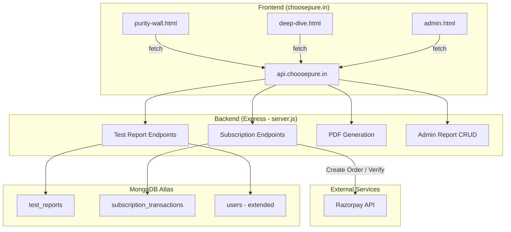
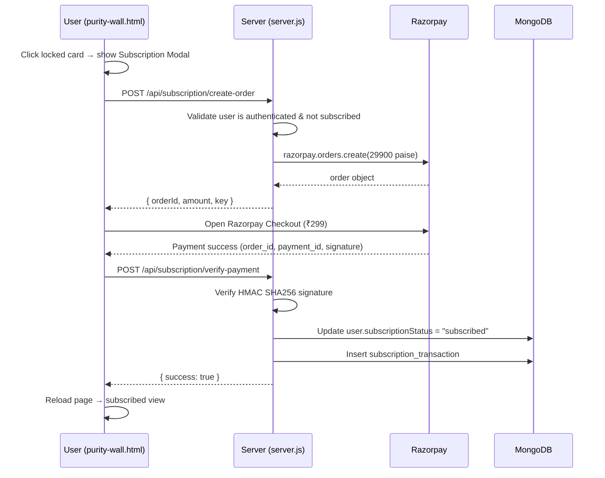
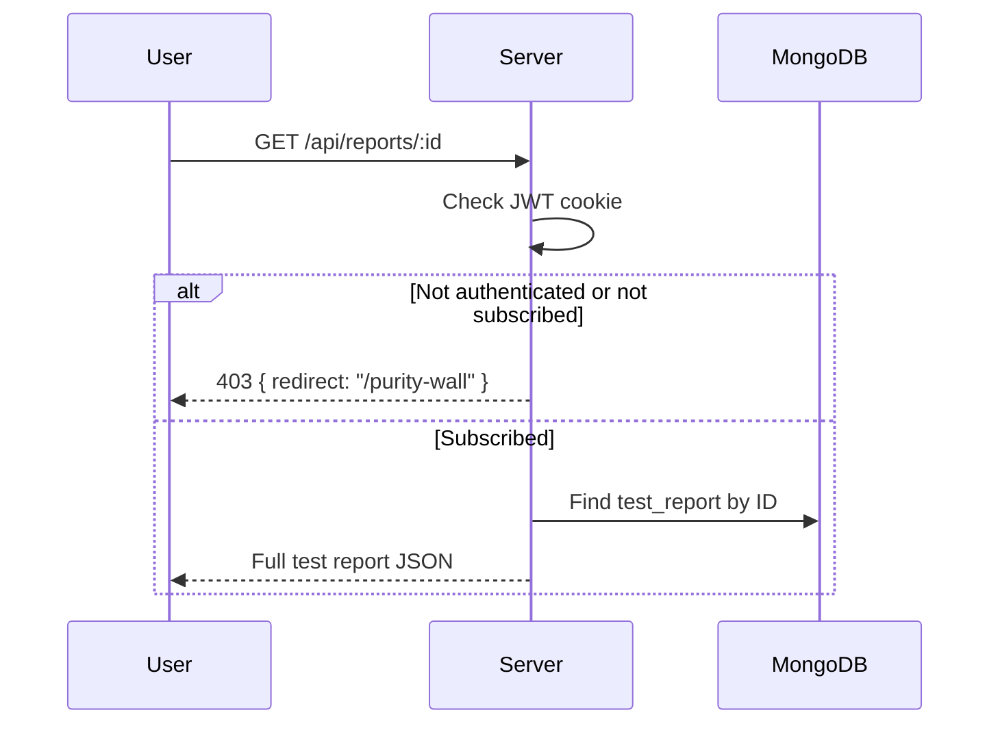

# Design Document: Product Purity Wall

## Overview

The Product Purity Wall is a subscription-gated page at `/purity-wall` that displays lab-tested product results as a grid of product cards. It introduces a freemium model: visitors and non-subscribed users see one unlocked card with the rest blurred/locked, while subscribed users (₹299/month via Razorpay) see all results unlocked with filters, search, status badges, and access to deep-dive report pages with expert commentary and PDF downloads.

The feature extends the existing Node.js/Express backend (`server.js`) with new API endpoints for test reports, subscription management, and PDF generation. It adds a new `test_reports` MongoDB collection and a `subscription_transactions` collection. Two new static HTML pages are introduced: `purity-wall.html` (the grid + subscription modal) and `deep-dive.html` (individual report page). The existing `admin.html` is extended with a test report management section. The existing `users` collection gains a `subscriptionStatus` field.

The architecture follows existing patterns: static HTML pages served from the Express server, JWT cookie auth, Razorpay for payments, and MongoDB Atlas for persistence.

## Architecture



### Subscription Payment Flow



### Deep-Dive Report Access Flow



## Components and Interfaces

### Backend API Endpoints (added to server.js)

| Method | Endpoint | Auth | Description |
|--------|----------|------|-------------|
| GET | `/api/reports` | Public | List published test reports (returns limited data for non-subscribed) |
| GET | `/api/reports/:id` | User (subscribed) | Get full test report for deep-dive page |
| GET | `/api/reports/:id/pdf` | User (subscribed) | Generate and download PDF report |
| POST | `/api/subscription/create-order` | User | Create Razorpay order for ₹299 subscription |
| POST | `/api/subscription/verify-payment` | User | Verify payment and activate subscription |
| POST | `/api/admin/reports` | Admin JWT | Create a new test report |
| GET | `/api/admin/reports` | Admin JWT | List all test reports (including unpublished) |
| PUT | `/api/admin/reports/:id` | Admin JWT | Update a test report |
| DELETE | `/api/admin/reports/:id` | Admin JWT | Delete a test report |

### Frontend Pages

**purity-wall.html** — New static HTML page at `/purity-wall`:
- Top nav matching existing site header (logo, Dashboard/Lab Reports/Insights/Alerts links, user icon)
- Conditional header: "See how your milk compares" (non-subscribed) or "Your Purity Dashboard" (subscribed)
- Search bar + category filter (disabled/grayed for non-subscribed, enabled for subscribed)
- Responsive product card grid (min 300px card width)
- Non-subscribed view: first card unlocked, rest blurred with 🔒 overlay
- Subscription modal on locked card click (risk-based prompt, ₹299 CTA, Razorpay checkout)
- Subscribed view: all cards unlocked with purity scores, status badges, "Download PDF Report" buttons
- Empty state when no reports exist
- Pagination at bottom
- Auth modal integration (reused from existing pages)

**deep-dive.html** — New static HTML page at `/deep-dive?id=<reportId>`:
- Breadcrumb navigation (Products > Category > Product Name)
- Product name, category, purity score circle (color-coded)
- Test parameter sections (Heavy Metals, Antibiotics & Hormones, Adulterant Check) with measured values and acceptable ranges
- Expert commentary card (Dr. Aman Mann with photo)
- Product image with batch code and shelf life
- "Download Certificate" / "Download PDF Report" button
- Methodology note
- Redirect to purity-wall with modal if non-subscribed user accesses directly

**admin.html** — Extended with "Test Reports" section:
- Create report form: product name, brand, category, image URL, purity score (0-10), test parameters (dynamic rows), expert commentary, status badges
- List of existing reports with edit/delete actions
- Inline editing support

### Server-Side Additions (all in server.js)

- `testReportsCollection` — new MongoDB collection reference
- `subscriptionTransactionsCollection` — new MongoDB collection reference
- `subscriptionStatus` field added to user registration (default: `free`)
- `subscriptionStatus` included in `/api/user/me` response
- Optional `authenticateSubscribedUser` middleware — extends `authenticateUser` to also check `subscriptionStatus === 'subscribed'`
- PDF generation using a lightweight library (e.g., `pdfkit`) for report downloads

### Dependencies to Add

```json
{
  "pdfkit": "^0.15.0"
}
```

## Data Models

### Test Reports Collection (`test_reports`)

```javascript
{
  _id: ObjectId,
  productName: String,        // required — e.g., "Amul Gold Milk"
  brandName: String,          // required — e.g., "Amul"
  category: String,           // required — e.g., "Dairy"
  imageUrl: String,           // required — product image URL
  purityScore: Number,        // required — 0.0 to 10.0 (one decimal)
  testParameters: [           // required — array of test results
    {
      section: String,        // e.g., "Heavy Metals Analysis"
      parameters: [
        {
          name: String,       // e.g., "Lead"
          measuredValue: String, // e.g., "0.02 mg/kg"
          acceptableRange: String, // e.g., "< 0.1 mg/kg"
          status: String      // "pass" | "warning" | "fail"
        }
      ]
    }
  ],
  expertCommentary: String,   // Dr. Aman Mann's commentary text
  statusBadges: [String],     // e.g., ["Recent Test", "Top Rated"] or ["Alert: High Lead Found"]
  batchCode: String,          // optional — batch identifier
  shelfLife: String,          // optional — e.g., "6 months"
  testDate: Date,             // optional — when the lab test was conducted
  methodology: String,        // optional — testing methodology notes
  published: Boolean,         // default: true — controls visibility on purity wall
  createdAt: Date,
  updatedAt: Date
}
```

Indexes:
- `{ published: 1, createdAt: -1 }` — for public listing (published reports, newest first)
- `{ category: 1 }` — for category filter queries

### Subscription Transactions Collection (`subscription_transactions`)

```javascript
{
  _id: ObjectId,
  userId: ObjectId,           // reference to users._id
  userName: String,           // denormalized
  userEmail: String,          // denormalized
  amount: Number,             // 299 (INR)
  razorpayOrderId: String,
  razorpayPaymentId: String,
  razorpaySignature: String,
  status: String,             // "completed"
  createdAt: Date
}
```

Indexes:
- `{ userId: 1 }` — for user subscription lookups
- `{ createdAt: -1 }` — for admin transaction listing

### Users Collection (extended fields)

```javascript
{
  // ... existing fields (name, email, phone, pincode, password, role, createdAt)
  subscriptionStatus: String,  // "free" | "subscribed", default: "free"
  subscribedAt: Date           // set when subscription is activated
}
```


## Correctness Properties

*A property is a characteristic or behavior that should hold true across all valid executions of a system — essentially, a formal statement about what the system should do. Properties serve as the bridge between human-readable specifications and machine-verifiable correctness guarantees.*

### Property 1: Published reports are returned newest-first

*For any* set of published test reports with distinct creation dates, the public reports endpoint should return them sorted by `createdAt` in descending order, and should exclude any reports where `published` is `false`.

**Validates: Requirements 1.1**

### Property 2: Card rendering includes all required fields

*For any* test report, the data returned by the public reports endpoint should include `productName`, `brandName`, `category`, `imageUrl`, and `statusBadges` (when present on the report).

**Validates: Requirements 1.2, 5.2**

### Property 3: Card locking based on subscription status

*For any* list of N published test reports (N ≥ 1) and any user, if the user's `subscriptionStatus` is `free` (or the user is unauthenticated), exactly the first report should include its `purityScore` in the response and the remaining N-1 should have the score omitted/masked. If the user's `subscriptionStatus` is `subscribed`, all N reports should include their `purityScore`.

**Validates: Requirements 2.1, 2.2, 5.1**

### Property 4: Subscription modal content completeness

*For any* locked product card with a given brand name and category, the subscription modal data should contain the product's brand name, the count of contaminants found across that category's reports, and the total subscriber count.

**Validates: Requirements 3.2**

### Property 5: Subscription order amount is always ₹299

*For any* authenticated non-subscribed user, the subscription order creation endpoint should create a Razorpay order for exactly 29900 paise (₹299).

**Validates: Requirements 4.1**

### Property 6: Payment signature verification

*For any* `razorpay_order_id` and `razorpay_payment_id`, a signature computed as HMAC-SHA256 of `order_id|payment_id` using the Razorpay key secret should pass verification. *For any* signature that does not match this computation, verification should fail.

**Validates: Requirements 4.2**

### Property 7: Subscription status changes if and only if payment succeeds

*For any* user with `subscriptionStatus` equal to `free`, after a payment verification attempt: if the signature is valid, the user's `subscriptionStatus` should become `subscribed` and a `subscription_transaction` record should exist with the correct `razorpayOrderId`, `razorpayPaymentId`, `amount`, and `userId`. If the signature is invalid, the user's `subscriptionStatus` should remain `free` and no transaction record should be created.

**Validates: Requirements 4.3, 4.5**

### Property 8: Search filter returns matching reports (case-insensitive)

*For any* search string and any set of published test reports, the filtered results should contain only reports where `brandName` or `category` contains the search string (case-insensitive), and should contain all such matching reports.

**Validates: Requirements 6.1**

### Property 9: Category filter returns only matching category

*For any* selected category and any set of published test reports, the filtered results should contain only reports whose `category` exactly matches the selected category.

**Validates: Requirements 6.2**

### Property 10: Clearing filters restores full list

*For any* set of published test reports, applying any combination of search text and category filter and then clearing all filters should return the same set of reports as the unfiltered list.

**Validates: Requirements 6.3**

### Property 11: Deep-dive API returns complete report data

*For any* published test report accessed by a subscribed user, the deep-dive endpoint should return all fields: `productName`, `brandName`, `category`, `imageUrl`, `purityScore`, `testParameters` (each with `name`, `measuredValue`, `acceptableRange`, `status`), `expertCommentary`, and `statusBadges`.

**Validates: Requirements 7.1, 7.2, 7.3**

### Property 12: PDF generation returns valid PDF with report data

*For any* published test report, the PDF download endpoint should return a response with `Content-Type: application/pdf` and the PDF content should contain the product name and purity score.

**Validates: Requirements 7.4**

### Property 13: Non-subscribed users cannot access deep-dive reports

*For any* non-subscribed user or unauthenticated visitor, requesting the deep-dive report endpoint for any report ID should return a 403 status with a redirect indicator to the purity wall page.

**Validates: Requirements 7.5**

### Property 14: Test report CRUD round-trip

*For any* valid test report data, creating it via the admin API and then fetching it should return the same field values. Updating any field and then fetching should reflect the updated values.

**Validates: Requirements 8.3, 8.5**

### Property 15: Test report deletion removes from public listing

*For any* existing test report, deleting it via the admin API and then fetching the public reports list should not include the deleted report.

**Validates: Requirements 8.6**

### Property 16: New user registration defaults to free subscription

*For any* valid registration input, the created user document should have `subscriptionStatus` equal to `free`.

**Validates: Requirements 9.1**

### Property 17: User me endpoint includes subscription status

*For any* authenticated user, the `/api/user/me` response should include a `subscriptionStatus` field with value `free` or `subscribed`.

**Validates: Requirements 9.2**

### Property 18: Purity score color mapping

*For any* purity score in the range [0.0, 10.0], the score color should be: Deep Leaf Green (`#1F6B4E`) if score ≥ 7.0, Warning Amber (`#FFB703`) if 4.0 ≤ score ≤ 6.9, and Fail Red (`#D62828`) if score < 4.0.

**Validates: Requirements 10.2, 10.3, 10.4**

### Property 19: Purity score format

*For any* purity score in the range [0.0, 10.0], the formatted display string should match the pattern `X.X/10` (one decimal place followed by "/10").

**Validates: Requirements 10.1**

## Error Handling

| Scenario | Response | HTTP Status |
|----------|----------|-------------|
| Report creation with missing required fields | `{ success: false, message: "Missing required fields: ..." }` | 400 |
| Purity score outside 0-10 range | `{ success: false, message: "Purity score must be between 0 and 10" }` | 400 |
| Report not found (GET/PUT/DELETE by ID) | `{ success: false, message: "Report not found" }` | 404 |
| Non-subscribed user accessing deep-dive report | `{ success: false, message: "Subscription required", redirect: "/purity-wall" }` | 403 |
| Non-subscribed user accessing PDF download | `{ success: false, message: "Subscription required" }` | 403 |
| Subscription order for already-subscribed user | `{ success: false, message: "Already subscribed" }` | 400 |
| Subscription payment signature verification failure | `{ success: false, message: "Payment verification failed" }` | 400 |
| Missing payment verification fields | `{ success: false, message: "Payment verification details are incomplete" }` | 400 |
| Razorpay order creation failure | `{ success: false, message: "Payment initialization failed. Please try again." }` | 500 |
| Database not connected | `{ success: false, message: "Database not connected" }` | 500 |
| Admin not authenticated | `{ success: false, message: "Authentication required" }` | 401 |
| User not authenticated (subscription endpoints) | `{ success: false, message: "Authentication required" }` | 401 |
| PDF generation failure | `{ success: false, message: "Failed to generate PDF report" }` | 500 |

Frontend error handling (purity-wall.html / deep-dive.html):
- Network errors: display "Unable to connect. Please check your internet connection and try again." with retry button
- API errors: display the server's error message
- Razorpay modal dismissed: display "Payment was cancelled. You can subscribe anytime to unlock all reports."
- Loading states: show spinner while fetching reports
- Empty state: "No lab reports available yet. Check back soon." when no published reports exist

## Testing Strategy

### Unit Tests

Unit tests cover specific examples and edge cases:

- Report creation with all valid fields returns success
- Report creation with missing `productName` returns 400
- Report creation with `purityScore` = -1 or 11 returns validation error
- Subscription order creation for already-subscribed user returns 400
- Deep-dive endpoint returns 403 for unauthenticated request
- Deep-dive endpoint returns 403 for non-subscribed user
- PDF endpoint returns 403 for non-subscribed user
- Admin report endpoints return 401 without admin JWT cookie
- Public reports endpoint returns empty array when no published reports exist
- Score color: 7.0 → `#1F6B4E`, 5.5 → `#FFB703`, 3.9 → `#D62828`
- Score format: 9.2 → `"9.2/10"`, 10.0 → `"10.0/10"`, 0.0 → `"0.0/10"`
- Search filter with empty string returns all reports
- Category filter with non-existent category returns empty array
- Payment signature verification with known test vector
- Delete non-existent report returns 404

### Property-Based Tests

Property-based tests validate universal properties across randomly generated inputs. Use `fast-check` as the PBT library for JavaScript/Node.js.

Each property test must:
- Run a minimum of 100 iterations
- Reference the design document property with a tag comment
- Use `fast-check` arbitraries to generate random inputs

Property test mapping:

| Property | Test Description | Generator Strategy |
|----------|-----------------|-------------------|
| Property 1 | Generate reports with random dates, verify sort order | `fc.array(fc.date())` for creation dates |
| Property 2 | Generate random report data, verify all fields present in response | `fc.record` with required string fields |
| Property 3 | Generate N reports + subscription status, verify lock/unlock count | `fc.nat`, `fc.constantFrom("free", "subscribed")` |
| Property 4 | Generate product with category, verify modal data completeness | `fc.record` for product data |
| Property 5 | Generate random user data, verify order amount is always 29900 | `fc.record` for user info |
| Property 6 | Generate random order_id and payment_id, compute HMAC, verify | `fc.string` pairs |
| Property 7 | Generate user + valid/invalid signature, check status change | `fc.boolean` for valid/invalid |
| Property 8 | Generate reports + search string, verify filter correctness | `fc.array` of reports, `fc.string` |
| Property 9 | Generate reports + category, verify category filter | `fc.array` of reports, `fc.string` |
| Property 10 | Generate reports, apply random filters then clear, verify restoration | `fc.array` of reports, `fc.string` |
| Property 11 | Generate full report, fetch via deep-dive, verify all fields | `fc.record` with all report fields |
| Property 12 | Generate report, request PDF, verify content-type and content | `fc.record` for report data |
| Property 13 | Generate report ID + non-subscribed user, verify 403 | `fc.string` for report ID |
| Property 14 | Generate report, create, fetch, update, fetch again, verify | `fc.record` for report data |
| Property 15 | Generate report, create, delete, verify absent from list | `fc.record` for report data |
| Property 16 | Generate valid registration data, verify subscriptionStatus = "free" | `fc.record` for user fields |
| Property 17 | Generate authenticated user, verify me response includes status | `fc.constantFrom("free", "subscribed")` |
| Property 18 | Generate score 0.0-10.0, verify color mapping | `fc.float({ min: 0, max: 10 })` |
| Property 19 | Generate score 0.0-10.0, verify format matches X.X/10 | `fc.float({ min: 0, max: 10 })` |

Tag format for each test: `// Feature: product-purity-wall, Property {N}: {title}`

Example:
```javascript
// Feature: product-purity-wall, Property 18: Purity score color mapping
test('score color is determined by threshold ranges', () => {
  fc.assert(
    fc.property(
      fc.float({ min: 0, max: 10, noNaN: true }),
      (score) => {
        const color = getScoreColor(score);
        if (score >= 7.0) expect(color).toBe('#1F6B4E');
        else if (score >= 4.0) expect(color).toBe('#FFB703');
        else expect(color).toBe('#D62828');
      }
    ),
    { numRuns: 100 }
  );
});
```
