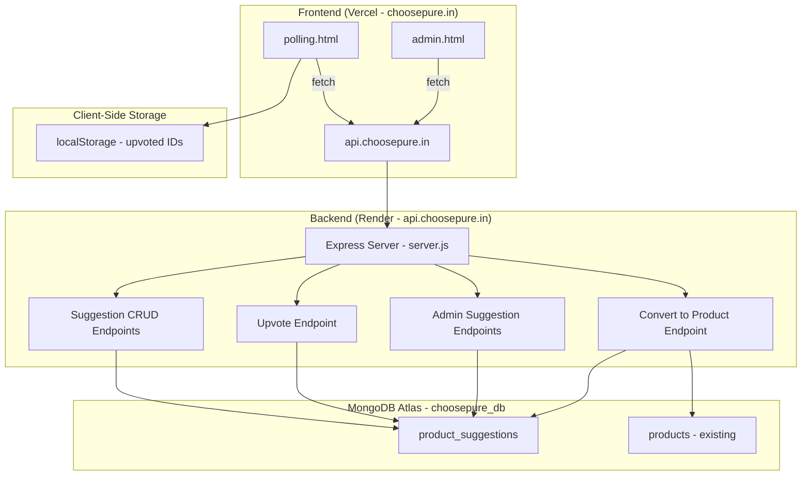
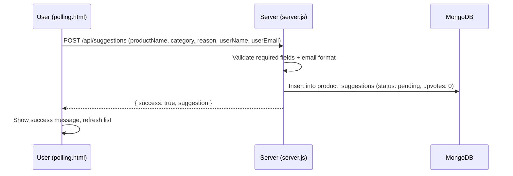
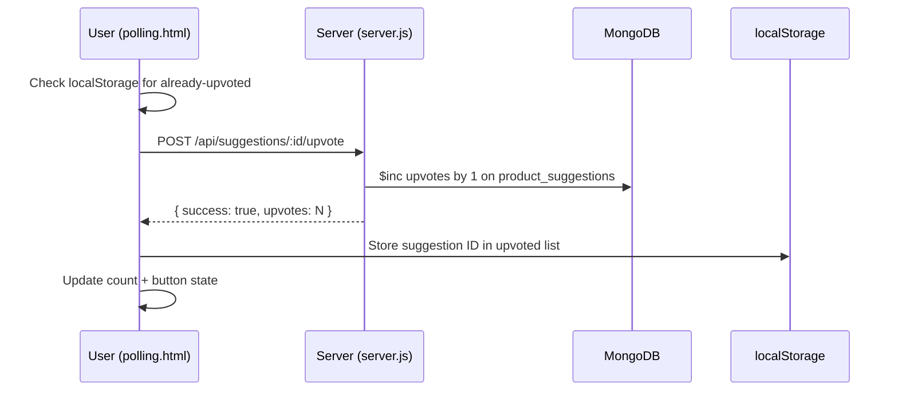
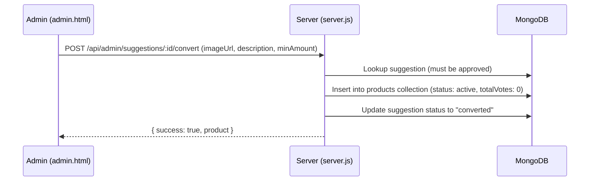

# Design Document: Product Suggestion & Upvote

## Overview

This feature adds a product suggestion submission and community upvoting system to the ChoosePure polling page. Users can suggest products they want independently tested, and other users can upvote those suggestions (free, no payment). Admins manage suggestions (approve/reject/delete) and can convert approved suggestions into actual poll products.

The implementation extends the existing Node.js/Express backend (`server.js`) with new API endpoints, adds a new `product_suggestions` MongoDB collection, adds a suggestion form and suggestions list to `polling.html`, and adds a suggestions management subsection to the Product Polling section in `admin.html`.

## Architecture



### Request Flow: Suggestion Submission



### Request Flow: Upvote



### Request Flow: Convert Suggestion to Product



## Components and Interfaces

### Backend API Endpoints (added to server.js)

| Method | Endpoint | Auth | Description |
|--------|----------|------|-------------|
| POST | `/api/suggestions` | Public | Submit a new product suggestion |
| GET | `/api/suggestions` | Public | List approved suggestions sorted by upvotes desc |
| POST | `/api/suggestions/:id/upvote` | Public | Increment upvote count for a suggestion |
| GET | `/api/admin/suggestions` | Admin JWT | List all suggestions (any status) |
| PUT | `/api/admin/suggestions/:id/status` | Admin JWT | Update suggestion status (pending/approved/rejected) |
| DELETE | `/api/admin/suggestions/:id` | Admin JWT | Delete a suggestion |
| POST | `/api/admin/suggestions/:id/convert` | Admin JWT | Convert approved suggestion to poll product |

### Frontend Components

**polling.html** — Extended with:
- "Suggest a Product" section below the product voting grid with form fields: product name, category/type, reason, user name, user email
- Approved suggestions list showing product name, category, reason, submitter first name, upvote count, date
- Upvote button per suggestion with localStorage-based "already upvoted" visual state
- Loading/error states for suggestions list

**admin.html** — Extended with:
- "Product Suggestions" subsection within the existing Product Polling section
- Suggestions table: product name, category, reason, submitter name, email, status badge, upvote count, date
- Status dropdown/buttons (pending → approved/rejected)
- Delete button with confirmation
- "Convert to Product" button for approved suggestions, opening a pre-filled form modal

### Server-Side Additions (in server.js)

- `suggestionsCollection` variable initialized during `connectToDatabase()`
- Index on `product_suggestions`: `{ status: 1, upvotes: -1 }` for public listing
- Index on `product_suggestions`: `{ createdAt: -1 }` for admin listing
- Validation: product name required, category required, user name required, email regex validation
- Reuses existing `authenticateAdmin` middleware for admin endpoints
- Reuses existing product creation logic when converting suggestion to product

## Data Models

### Product Suggestions Collection (`product_suggestions`)

```javascript
{
  _id: ObjectId,
  productName: String,    // required, name of the suggested product
  category: String,       // required, product type (e.g. "Milk", "Ghee", "Honey")
  reason: String,         // optional, why the user wants this tested
  userName: String,       // required, submitter's name
  userEmail: String,      // required, submitter's email
  upvotes: Number,        // default: 0, incremented on upvote
  status: String,         // "pending" | "approved" | "rejected" | "converted", default: "pending"
  createdAt: Date,        // auto-set on creation
  updatedAt: Date         // auto-set on status change
}
```

Indexes:
- `{ status: 1, upvotes: -1 }` — for public listing (approved suggestions sorted by upvotes)
- `{ createdAt: -1 }` — for admin listing (most recent first)


## Correctness Properties

*A property is a characteristic or behavior that should hold true across all valid executions of a system — essentially, a formal statement about what the system should do. Properties serve as the bridge between human-readable specifications and machine-verifiable correctness guarantees.*

### Property 1: Suggestion creation round-trip

*For any* valid suggestion input (non-empty productName, non-empty category, non-empty userName, valid email), creating the suggestion and then reading it back from the database should return the same field values, with upvotes equal to 0, status equal to "pending", and a createdAt timestamp present.

**Validates: Requirements 1.2, 2.4**

### Property 2: Suggestion validation rejects incomplete submissions

*For any* subset of the required suggestion fields (productName, category, userName, userEmail) that is missing at least one field, the server should reject the submission with a 400 response and the error should identify the missing fields.

**Validates: Requirements 2.1, 2.2**

### Property 3: Email validation rejects invalid formats

*For any* string that does not match a valid email pattern (missing @, missing domain, etc.), submitting a suggestion with that string as the email should be rejected with a 400 response indicating the email is invalid.

**Validates: Requirements 2.3**

### Property 4: Public suggestions endpoint returns only approved suggestions sorted by upvotes descending

*For any* set of suggestions with mixed statuses (pending, approved, rejected, converted) and varying upvote counts, the public suggestions endpoint should return only suggestions with status "approved", and the results should be sorted by upvotes in descending order.

**Validates: Requirements 3.1, 3.2, 3.3**

### Property 5: Upvote increments count by exactly one

*For any* suggestion with N upvotes, after a successful upvote request, the suggestion's upvote count should equal N + 1.

**Validates: Requirements 4.2**

### Property 6: Admin suggestions endpoint returns all suggestions sorted by date descending

*For any* set of suggestions with mixed statuses, the admin suggestions endpoint should return all of them regardless of status, each containing productName, category, reason, userName, userEmail, status, upvotes, and createdAt, sorted by createdAt in descending order.

**Validates: Requirements 5.1, 5.2, 5.3, 5.4**

### Property 7: Status update persists new status and sets updatedAt

*For any* existing suggestion and any valid target status (approved, rejected, pending), updating the suggestion's status should persist the new status in the database and set an updatedAt timestamp.

**Validates: Requirements 6.2, 6.3**

### Property 8: Suggestion deletion removes the suggestion

*For any* existing suggestion, deleting it and then attempting to fetch it should result in the suggestion not being found.

**Validates: Requirements 7.2**

### Property 9: Conversion creates product and marks suggestion as converted

*For any* approved suggestion and valid conversion data (imageUrl, description, minAmount > 0), converting the suggestion should create a new product in the products collection with totalVotes equal to 0, status equal to "active", and the provided details. The suggestion's status should be updated to "converted".

**Validates: Requirements 8.3, 8.4**

### Property 10: Conversion validation rejects missing fields

*For any* conversion request missing at least one required field (imageUrl, description, minAmount), the server should reject it with a 400 response identifying the missing fields.

**Validates: Requirements 8.6**

## Error Handling

| Scenario | Response | HTTP Status |
|----------|----------|-------------|
| Suggestion with missing required fields | `{ success: false, message: "Missing required fields: ..." }` | 400 |
| Suggestion with invalid email format | `{ success: false, message: "Please enter a valid email address" }` | 400 |
| Upvote for non-existent suggestion | `{ success: false, message: "Suggestion not found" }` | 404 |
| Status update for non-existent suggestion | `{ success: false, message: "Suggestion not found" }` | 404 |
| Delete non-existent suggestion | `{ success: false, message: "Suggestion not found" }` | 404 |
| Convert non-approved suggestion | `{ success: false, message: "Only approved suggestions can be converted" }` | 400 |
| Convert non-existent suggestion | `{ success: false, message: "Suggestion not found" }` | 404 |
| Conversion with missing fields | `{ success: false, message: "Missing required fields: ..." }` | 400 |
| Conversion with invalid minAmount (≤ 0) | `{ success: false, message: "Minimum amount must be greater than 0" }` | 400 |
| Database not connected | `{ success: false, message: "Database not connected" }` | 500 |
| Admin not authenticated | `{ success: false, message: "Authentication required" }` | 401 |

Frontend error handling (polling.html):
- Network errors on suggestion submit: display "Unable to submit. Please check your connection and try again."
- Network errors on suggestions fetch: display "Unable to load suggestions." with retry
- Upvote API error: show brief toast notification and revert the optimistic count update
- Loading states: show spinner while fetching suggestions list

## Testing Strategy

### Unit Tests

Unit tests should cover specific examples and edge cases:

- Suggestion creation with all valid fields returns success
- Suggestion creation with empty productName returns 400
- Suggestion creation with missing category returns 400
- Suggestion creation with invalid email returns 400
- Upvote on existing suggestion returns incremented count
- Upvote on non-existent suggestion returns 404
- Admin status update to "approved" returns success
- Admin status update on non-existent suggestion returns 404
- Admin delete on existing suggestion returns success
- Admin delete on non-existent suggestion returns 404
- Convert approved suggestion with valid data creates product
- Convert non-approved suggestion returns 400
- Convert with missing imageUrl returns 400
- Admin endpoints return 401 without JWT cookie
- Public suggestions endpoint returns empty array when no approved suggestions exist

### Property-Based Tests

Property-based tests validate universal properties across randomly generated inputs. Use `fast-check` as the PBT library for JavaScript/Node.js.

Each property test must:
- Run a minimum of 100 iterations
- Reference the design document property with a tag comment
- Use `fast-check` arbitraries to generate random inputs

Property test mapping:

| Property | Test Description | Generator Strategy |
|----------|-----------------|-------------------|
| Property 1 | Generate valid suggestion data, create and read back | `fc.record` with `fc.string({minLength:1})` for required fields, valid email via custom arbitrary |
| Property 2 | Generate random subsets of required fields with at least one missing, verify 400 | `fc.record` with optional fields, filter to ensure at least one missing |
| Property 3 | Generate random non-email strings, verify rejection | `fc.string()` filtered to exclude valid email patterns |
| Property 4 | Generate array of suggestions with random statuses and upvote counts, verify filtering and sort | `fc.array` of suggestions with `fc.constantFrom("pending","approved","rejected","converted")` |
| Property 5 | Generate suggestion with random upvote count, upvote once, verify N+1 | `fc.nat()` for initial upvotes |
| Property 6 | Generate array of suggestions with mixed statuses and dates, verify all returned and sorted | `fc.array` of suggestions with `fc.date()` |
| Property 7 | Generate suggestion, update to random valid status, verify persistence | `fc.constantFrom("pending","approved","rejected")` |
| Property 8 | Generate suggestion, delete, verify not found | `fc.record` for suggestion data |
| Property 9 | Generate approved suggestion + valid conversion data, verify product created and status updated | `fc.record` with `fc.string({minLength:1})`, `fc.integer({min:1})` |
| Property 10 | Generate conversion requests with at least one missing field, verify 400 | `fc.record` with optional fields |

Tag format for each test: `// Feature: product-suggestion-upvote, Property {N}: {title}`

Example:
```javascript
// Feature: product-suggestion-upvote, Property 5: Upvote increments count by exactly one
test('upvote increments count by exactly one', () => {
  fc.assert(
    fc.property(
      fc.nat({ max: 10000 }),
      async (initialUpvotes) => {
        // Create suggestion with initialUpvotes, then upvote, verify count = initialUpvotes + 1
        const suggestion = await createSuggestionWithUpvotes(initialUpvotes);
        await request(app).post(`/api/suggestions/${suggestion._id}/upvote`);
        const updated = await getSuggestion(suggestion._id);
        expect(updated.upvotes).toBe(initialUpvotes + 1);
      }
    ),
    { numRuns: 100 }
  );
});
```
