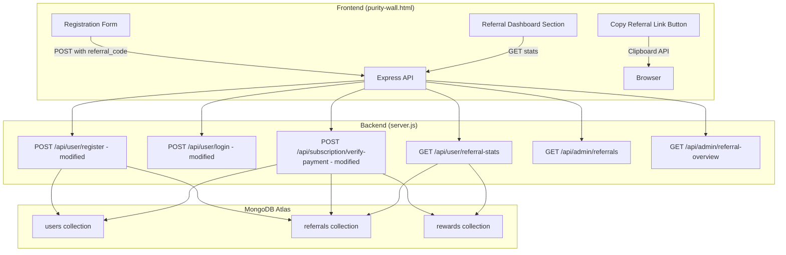
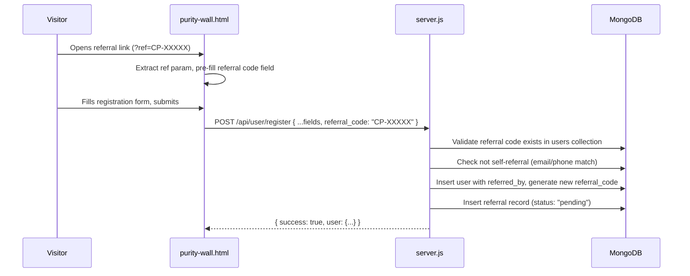
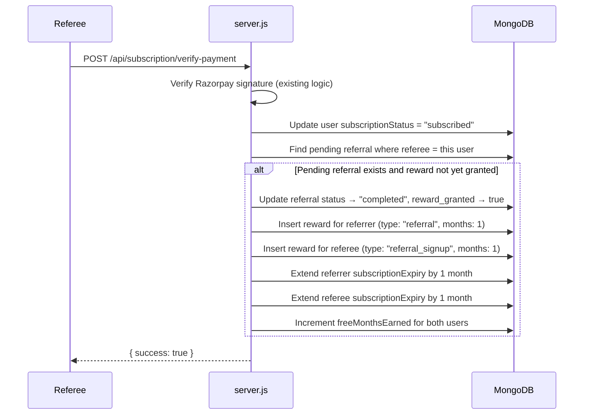

# Design Document: Referral Program

## Overview

The referral program adds a viral growth loop to ChoosePure by assigning each registered user a unique referral code (format: `CP-XXXXX`) and rewarding both referrer and referee with one free month of subscription when the referee subscribes. The feature integrates into the existing Node.js/Express backend (`server.js`), the MongoDB database, and the vanilla HTML/JS frontend (`purity-wall.html`).

Key additions:
- Two new MongoDB collections: `referrals` and `rewards`
- New fields on the `users` collection: `referral_code`, `referred_by`, `freeMonthsEarned`, `subscriptionExpiry`
- Modifications to the existing `/api/user/register` and `/api/subscription/verify-payment` endpoints
- A referral code backfill on login for existing users
- A new "Referral" section on the purity wall dashboard
- Admin API endpoints for referral program monitoring

The architecture follows existing patterns: all backend logic in `server.js`, JWT httpOnly cookie auth, MongoDB Atlas for persistence, and inline JS in the HTML pages.

## Architecture



### Referral Signup Flow



### Reward Granting Flow (on subscription verification)



## Components and Interfaces

### Backend API Endpoints

#### Modified Endpoints

| Method | Endpoint | Auth | Changes |
|--------|----------|------|---------|
| POST | `/api/user/register` | Public | Accept optional `referral_code` field. Generate `referral_code` for new user. Validate referral code. Create referral record if valid code provided. |
| POST | `/api/user/login` | Public | Backfill `referral_code` for existing users who don't have one. Return `referral_code` in response. |
| POST | `/api/subscription/verify-payment` | User | After payment verification, check for pending referral. Grant rewards to both parties. Extend subscription expiry. |
| GET | `/api/user/me` | User | Return `referral_code`, `freeMonthsEarned`, `subscriptionExpiry` in response. |

#### New Endpoints

| Method | Endpoint | Auth | Description |
|--------|----------|------|-------------|
| GET | `/api/user/referral-stats` | User | Returns referral dashboard data: total invited, completed, pending, free months earned, referral code, referral link. |
| GET | `/api/admin/referral-overview` | Admin | Returns aggregate stats: total referrals, completed count, total free months granted. |
| GET | `/api/admin/referrals` | Admin | Returns paginated referral records with referrer/referee names, status, reward status, dates. |

### API Request/Response Contracts

**POST /api/user/register** (modified)
```json
// Request body (referral_code is optional)
{
  "name": "string",
  "email": "string",
  "phone": "string",
  "pincode": "string",
  "password": "string",
  "referral_code": "string | undefined"
}

// Success response
{
  "success": true,
  "user": {
    "name": "string",
    "email": "string",
    "subscriptionStatus": "free",
    "referral_code": "CP-XXXXX"
  }
}
```

**GET /api/user/referral-stats**
```json
// Response
{
  "success": true,
  "referral_code": "CP-AB12C",
  "referral_link": "https://choosepure.in/signup?ref=CP-AB12C",
  "total_invited": 5,
  "completed": 2,
  "pending": 3,
  "free_months_earned": 2
}
```

**GET /api/admin/referral-overview**
```json
// Response
{
  "success": true,
  "total_referrals": 150,
  "completed_referrals": 45,
  "total_free_months_granted": 90
}
```

**GET /api/admin/referrals**
```json
// Response
{
  "success": true,
  "referrals": [
    {
      "referrer_name": "string",
      "referee_name": "string",
      "status": "pending | completed",
      "reward_granted": false,
      "created_at": "ISO date string"
    }
  ]
}
```

### Frontend Changes (purity-wall.html)

**Registration Form Modification:**
- Add an optional "Referral Code" input field (`id="auth-register-referral"`) below the password field
- On page load, check for `ref` query parameter and pre-fill the referral code field
- Send `referral_code` in the registration POST body

**Referral Dashboard Section:**
- New section added between the voting section and the suggest section
- Only visible to authenticated users
- Displays: referral code, copy-link button, stats cards (total invited, successful, pending, free months)
- Shows encouraging prompt when user has zero referrals
- Copy button uses `navigator.clipboard.writeText()` with a "Copied!" confirmation toast

### Referral Code Generation Logic

```
function generateReferralCode():
  chars = "ABCDEFGHIJKLMNOPQRSTUVWXYZ0123456789"
  loop:
    code = "CP-" + 5 random chars from `chars`
    if code not in users.referral_code:
      return code
    // retry on collision
```

The code is generated server-side using `crypto.randomBytes` for randomness, formatted as `CP-XXXXX`. A unique index on `users.referral_code` guarantees uniqueness. On collision (duplicate key error), the function retries up to 5 times.

### Subscription Expiry Extension Logic

When granting a free month reward:
1. Read the user's current `subscriptionExpiry` date
2. If `subscriptionExpiry` exists and is in the future, add 1 calendar month to it
3. If `subscriptionExpiry` is null or in the past, add 1 calendar month to `new Date()` (now)
4. Update the user document with the new `subscriptionExpiry` and increment `freeMonthsEarned`

Free months stack: each reward extends from the current expiry, not from today.

## Data Models

### Users Collection (extended fields)

```javascript
{
  // ... existing fields (name, email, phone, pincode, password, role, subscriptionStatus, createdAt)
  referral_code: String,          // "CP-XXXXX", unique, generated on registration or backfill
  referred_by: ObjectId | null,   // referrer's user _id, set during registration if referral code used
  freeMonthsEarned: Number,       // default: 0, incremented when reward granted
  subscriptionExpiry: Date | null  // extended by free months; null if no free months earned
}
```

New indexes:
- `{ referral_code: 1 }` — unique index for referral code lookups

### Referrals Collection (`referrals`)

```javascript
{
  _id: ObjectId,
  referrer_user_id: ObjectId,     // the user who shared the code
  referee_user_id: ObjectId,      // the user who signed up with the code
  status: String,                 // "pending" | "completed"
  reward_granted: Boolean,        // default: false
  created_at: Date,               // when the referee registered
  completed_at: Date | null       // when the referee subscribed (reward triggered)
}
```

Indexes:
- `{ referrer_user_id: 1 }` — for dashboard queries (list my referrals)
- `{ referee_user_id: 1 }` — for reward lookup on subscription verification
- `{ referrer_user_id: 1, referee_user_id: 1 }` — unique compound index to prevent duplicate referral records

### Rewards Collection (`rewards`)

```javascript
{
  _id: ObjectId,
  user_id: ObjectId,              // the user receiving the reward
  reward_type: String,            // "referral" (for referrer) | "referral_signup" (for referee)
  months: Number,                 // always 1
  source: ObjectId,               // the other party's user _id
  created_at: Date
}
```

Indexes:
- `{ user_id: 1 }` — for querying a user's reward history


## Correctness Properties

*A property is a characteristic or behavior that should hold true across all valid executions of a system — essentially, a formal statement about what the system should do. Properties serve as the bridge between human-readable specifications and machine-verifiable correctness guarantees.*

### Property 1: Referral code format

*For any* newly registered user, the generated `referral_code` stored in their user document SHALL match the pattern `CP-XXXXX` where X is an uppercase alphanumeric character (regex: `/^CP-[A-Z0-9]{5}$/`).

**Validates: Requirements 1.1, 1.2**

### Property 2: Referral link round-trip

*For any* valid referral code `CP-XXXXX`, constructing the referral link `https://choosepure.in/signup?ref=CP-XXXXX` and then extracting the `ref` query parameter SHALL yield the original referral code.

**Validates: Requirements 2.1, 2.3**

### Property 3: Valid referral registration creates correct referral state

*For any* existing user with a referral code and any new valid registration using that code, the referee's `referred_by` field SHALL equal the referrer's `_id`, AND a referral record SHALL exist with `referrer_user_id` equal to the referrer's `_id`, `referee_user_id` equal to the referee's `_id`, `status` equal to `"pending"`, and `reward_granted` equal to `false`.

**Validates: Requirements 3.1, 3.2**

### Property 4: Invalid referral codes are rejected

*For any* referral code string that either (a) does not exist in any user's `referral_code` field, or (b) belongs to a user with the same email or phone as the registrant, the registration endpoint SHALL reject the referral code and the registration SHALL NOT create a referral record.

**Validates: Requirements 3.3, 3.4**

### Property 5: Subscription verification completes referral and grants rewards

*For any* referee with a `"pending"` referral record, when subscription payment is verified successfully, the referral record status SHALL become `"completed"` with `reward_granted` set to `true`, AND a reward record SHALL exist for the referrer with `reward_type` `"referral"` and `months` `1`, AND a reward record SHALL exist for the referee with `reward_type` `"referral_signup"` and `months` `1`.

**Validates: Requirements 4.1, 4.2, 4.3**

### Property 6: Reward idempotency

*For any* referee whose referral record already has status `"completed"`, triggering the reward flow again SHALL NOT create additional reward records and SHALL NOT further extend either party's `subscriptionExpiry`.

**Validates: Requirements 4.5, 7.5**

### Property 7: Free months stack cumulatively from current expiry

*For any* user with an existing `subscriptionExpiry` date in the future and any number N of sequential free month rewards (N ≥ 1), the final `subscriptionExpiry` SHALL be N calendar months after the original `subscriptionExpiry` (not N months after the current date), AND `freeMonthsEarned` SHALL equal the total number of rewards granted.

**Validates: Requirements 4.4, 5.1, 5.2, 5.3**

### Property 8: Referral stats accuracy

*For any* user with M total referral records (where C have status `"completed"` and P have status `"pending"`), the referral stats endpoint SHALL return `total_invited` equal to M, `completed` equal to C, `pending` equal to P (where P = M - C), and `free_months_earned` equal to the user's `freeMonthsEarned` value.

**Validates: Requirements 6.1, 6.2, 6.3, 6.4**

### Property 9: Phone number uniqueness prevents duplicate registration

*For any* phone number already associated with an existing user, attempting to register a new account with that phone number SHALL fail with an error, regardless of whether a referral code is provided.

**Validates: Requirements 7.3, 7.4**

### Property 10: Admin overview counts match records

*For any* set of referral records in the database, the admin referral overview endpoint SHALL return `total_referrals` equal to the total count of referral documents, `completed_referrals` equal to the count with status `"completed"`, and `total_free_months_granted` equal to the sum of `months` across all reward documents.

**Validates: Requirements 9.1**

## Error Handling

| Scenario | Response | HTTP Status |
|----------|----------|-------------|
| Invalid referral code (not found) | `{ success: false, message: "Invalid referral code" }` | 400 |
| Self-referral (own code) | `{ success: false, message: "Cannot use own referral code" }` | 400 |
| Email already registered | `{ success: false, message: "This email is already registered" }` | 400 |
| Phone already registered | `{ success: false, message: "This phone number is already registered" }` | 400 |
| Referral code collision (max retries) | `{ success: false, message: "Registration failed" }` | 500 |
| Database not connected | `{ success: false, message: "Database not connected" }` | 500 |
| User not authenticated (referral stats) | `{ success: false, message: "Authentication required" }` | 401 |
| Admin not authenticated (admin endpoints) | `{ success: false, message: "Authentication required" }` | 401 |
| Payment verification failed (existing) | `{ success: false, message: "Payment verification failed" }` | 400 |

Frontend error handling:
- Invalid referral code on registration: display error message from server below the referral code field
- Copy to clipboard failure: display "Could not copy. Please copy manually." fallback
- Network errors on referral stats: hide the referral dashboard section gracefully
- Referral link with invalid/expired ref param: show empty referral code field (no error, user can still register)

## Testing Strategy

### Unit Tests

Unit tests cover specific examples and edge cases:

- Registration without referral code succeeds, user has `referral_code` set, `referred_by` is null
- Registration with valid referral code sets `referred_by` and creates pending referral record
- Registration with non-existent referral code returns 400 "Invalid referral code"
- Registration with own referral code (same email) returns 400 "Cannot use own referral code"
- Registration with own referral code (same phone) returns 400 "Cannot use own referral code"
- Registration with duplicate email returns 400 "This email is already registered"
- Registration with duplicate phone returns 400 "This phone number is already registered"
- Login backfills referral code for user without one
- Login does not overwrite existing referral code
- Subscription verify-payment with pending referral completes it and creates 2 reward records
- Subscription verify-payment without pending referral works normally (no reward logic triggered)
- Double verify-payment does not create duplicate rewards
- Referral stats for user with 0 referrals returns all zeros
- Referral stats for user with mix of pending/completed returns correct counts
- Admin overview returns correct aggregate counts
- Admin referrals list includes referrer name, referee name, status, reward_granted, created_at
- Subscription expiry extension from null sets expiry to 1 month from now
- Subscription expiry extension from future date adds 1 month to that date
- Referral code generation produces CP-XXXXX format
- Copy button calls clipboard API with correct referral link URL
- URL with `?ref=CP-AB12C` pre-fills referral code field

### Property-Based Tests

Property-based tests validate universal properties across randomly generated inputs. Use `fast-check` as the PBT library for JavaScript/Node.js.

Each property test must:
- Run a minimum of 100 iterations
- Reference the design document property with a tag comment
- Use `fast-check` arbitraries to generate random inputs

Property test mapping:

| Property | Test Description | Generator Strategy |
|----------|-----------------|-------------------|
| Property 1 | Generate random registration data, verify referral code format | `fc.record` for user fields, verify `/^CP-[A-Z0-9]{5}$/` |
| Property 2 | Generate random valid referral codes, verify URL round-trip | `fc.stringOf(fc.constantFrom(...alphanumChars), {minLength:5, maxLength:5})` |
| Property 3 | Generate referrer + referee pairs, verify referral state | `fc.record` for both users |
| Property 4 | Generate invalid codes + self-referral scenarios, verify rejection | `fc.string()` for random codes, `fc.record` for self-referral |
| Property 5 | Generate referee with pending referral, verify completion + rewards | `fc.record` for user data |
| Property 6 | Generate completed referral, re-trigger, verify no duplicates | `fc.record` for referral data |
| Property 7 | Generate starting date + N rewards, verify cumulative expiry | `fc.date()`, `fc.integer({min:1, max:10})` |
| Property 8 | Generate M referrals with random statuses, verify stats counts | `fc.array(fc.constantFrom("pending","completed"))` |
| Property 9 | Generate existing phone + new registration, verify rejection | `fc.stringOf(fc.constantFrom(...digits), {minLength:10, maxLength:10})` |
| Property 10 | Generate referral/reward records, verify admin overview counts | `fc.array(fc.record(...))` for referrals and rewards |

Tag format for each test: `// Feature: referral-program, Property {N}: {title}`

Example:
```javascript
// Feature: referral-program, Property 1: Referral code format
test('generated referral codes match CP-XXXXX format', () => {
  fc.assert(
    fc.property(
      fc.record({
        name: fc.string({ minLength: 1 }),
        email: fc.emailAddress(),
        phone: fc.stringOf(fc.constantFrom('0','1','2','3','4','5','6','7','8','9'), { minLength: 10, maxLength: 10 }),
      }),
      (userData) => {
        const code = generateReferralCode();
        expect(code).toMatch(/^CP-[A-Z0-9]{5}$/);
      }
    ),
    { numRuns: 100 }
  );
});
```

```javascript
// Feature: referral-program, Property 7: Free months stack cumulatively from current expiry
test('free months extend from current expiry, not from now', () => {
  fc.assert(
    fc.property(
      fc.date({ min: new Date('2025-01-01'), max: new Date('2030-12-31') }),
      fc.integer({ min: 1, max: 10 }),
      (startExpiry, numMonths) => {
        let currentExpiry = new Date(startExpiry);
        for (let i = 0; i < numMonths; i++) {
          currentExpiry = extendExpiryByOneMonth(currentExpiry);
        }
        const expected = new Date(startExpiry);
        expected.setMonth(expected.getMonth() + numMonths);
        expect(currentExpiry.getTime()).toBe(expected.getTime());
      }
    ),
    { numRuns: 100 }
  );
});
```
