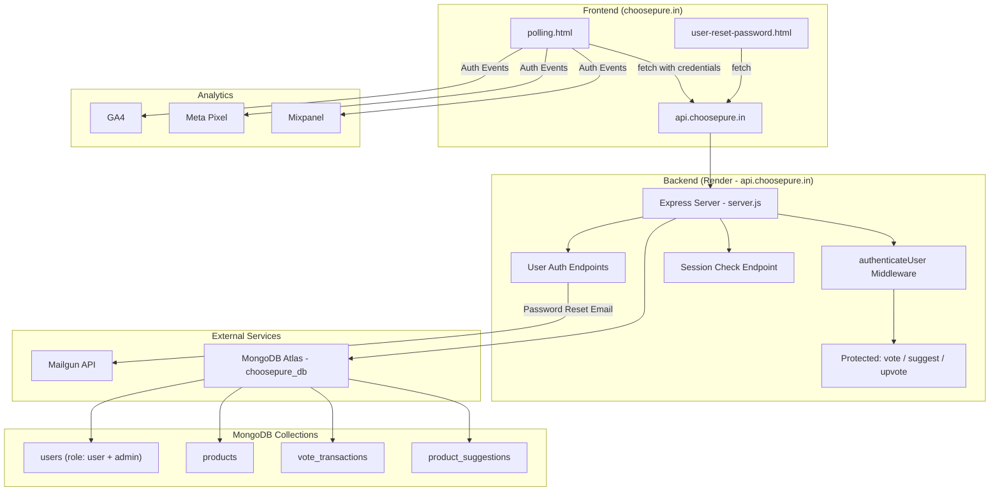
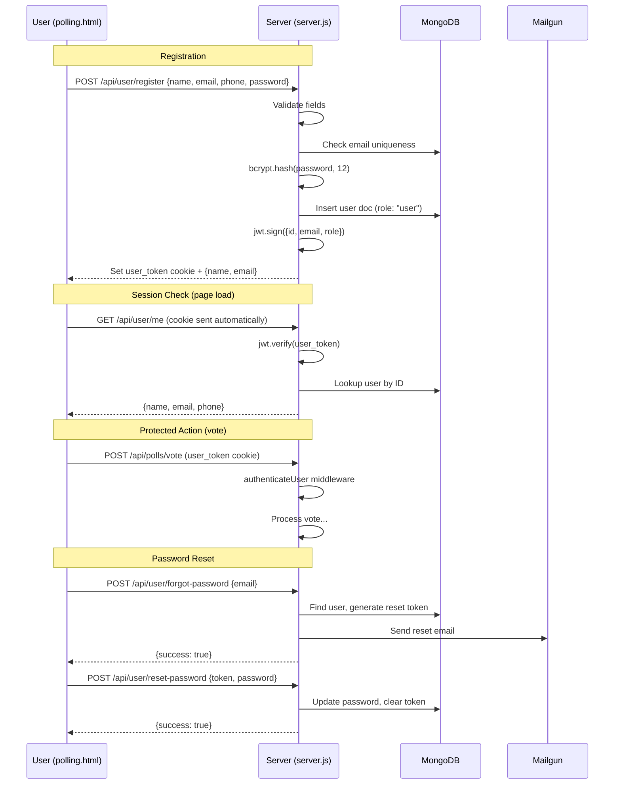

# Design Document: User Authentication for Polling Page

## Overview

This feature adds user registration, sign-in, session management, and password reset to the ChoosePure polling page (`polling.html`). Currently, voting, suggesting products, and upvoting suggestions are anonymous actions. After this feature, these actions require authentication — product browsing remains public.

The implementation reuses the existing `users` MongoDB collection (adding `role: "user"` documents alongside existing `role: "admin"` documents), mirrors the existing admin auth pattern (JWT in httpOnly cookie, middleware verification), and reuses the Mailgun-based password reset flow. The frontend adds an Auth Modal to `polling.html` with Sign In / Register tabs, and a header auth state indicator. Authenticated user details auto-fill the vote modal and suggestion form.

Key design decisions:
- Reuse `users` collection with `role` field to distinguish user types, avoiding a separate collection
- Mirror the `admin_token` / `authenticateAdmin` pattern with `user_token` / `authenticateUser`
- Auth modal is inline in `polling.html` (no separate pages) for a seamless single-page experience
- Password reset reuses the existing Mailgun + JWT reset token pattern from admin flow, with a dedicated `user-reset-password.html` page
- Protected actions remember the user's intent and auto-proceed after authentication

## Architecture



### Authentication Flow



## Components and Interfaces

### Backend API Endpoints (added to server.js)

| Method | Endpoint | Auth | Description |
|--------|----------|------|-------------|
| POST | `/api/user/register` | Public | Register a new user account |
| POST | `/api/user/login` | Public | Sign in with email + password |
| POST | `/api/user/logout` | Public | Clear user_token cookie |
| GET | `/api/user/me` | user_token | Get current user's profile (session check) |
| POST | `/api/user/forgot-password` | Public | Send password reset email |
| POST | `/api/user/reset-password` | Public | Reset password with token |

### Modified Existing Endpoints

| Endpoint | Change |
|----------|--------|
| `POST /api/polls/vote` | Add `authenticateUser` middleware; use `req.user` for user details |
| `POST /api/suggestions` | Add `authenticateUser` middleware; use `req.user` for user details |
| `POST /api/suggestions/:id/upvote` | Add `authenticateUser` middleware |

### New Middleware

`authenticateUser` — mirrors `authenticateAdmin`:
- Reads `user_token` from `req.cookies`
- Verifies JWT with `JWT_SECRET`
- Looks up user in `usersCollection` by decoded ID with `role: "user"`
- Attaches `{ id, email, name, phone }` to `req.user`
- Returns 401 if cookie missing, JWT invalid/expired, or user not found

### Frontend Components (polling.html)

**Auth Header** — added to existing `.header-nav`:
- Unauthenticated: "Sign In" link
- Authenticated: "Hi, {name}" text + "Sign Out" link

**Auth Modal** — new modal overlay:
- Two tabs: "Sign In" (default) and "Register"
- Sign In form: email, password, "Forgot Password?" link, submit button
- Register form: name, email, phone, password, submit button
- Forgot Password view: email field, "Send Reset Link" button, back link
- Error message display area below each form
- Loading state on submit buttons
- Brand-consistent styling (Deep Leaf Green buttons, Pure Ivory background, Inter font)

**Auth Gate Logic**:
- Stores `pendingAction` when unauthenticated user tries to vote/suggest/upvote
- After successful auth, replays the pending action automatically
- `pendingAction` format: `{ type: 'vote'|'suggest'|'upvote', data: {...} }`

**Auto-Fill Behavior**:
- On auth success or session restore, stores user data in a `currentUser` JS variable
- Vote modal: pre-fills name, email, phone; name and email become read-only
- Suggestion form: pre-fills name and email; both become read-only

### New Page

**user-reset-password.html** — standalone password reset page:
- Reads `token` from URL query parameter
- Form with new password + confirm password fields
- Calls `POST /api/user/reset-password`
- On success, shows message and links back to polling page
- Styled consistently with existing `admin-reset-password.html`

### Route Addition

| Route | File |
|-------|------|
| `GET /user/reset-password` | `user-reset-password.html` |

## Data Models

### Users Collection (`users`) — Extended Schema

Existing admin documents remain unchanged. New user documents:

```javascript
{
  _id: ObjectId,
  name: String,           // required, full name
  email: String,          // required, unique across collection
  phone: String,          // required, 10-digit string
  password: String,       // required, bcrypt hash (cost factor 12)
  role: String,           // "user" (existing admins have "admin")
  createdAt: Date,        // auto-set on registration
  last_login: Date,       // updated on each sign-in
  reset_token: String,    // JWT reset token (set during forgot-password, cleared after reset)
  reset_token_expires: Date // 1 hour from token generation
}
```

New indexes:
- `{ email: 1 }` — unique index (may already exist for admin accounts; ensure it covers all roles)
- `{ role: 1 }` — for role-filtered queries

### Vote Transactions — Modified

The `userName`, `userEmail`, `userPhone` fields continue to be stored (denormalized), but are now sourced from the authenticated user's profile via `req.user` rather than from the request body.

Additionally, a `userId` field (ObjectId reference to `users._id`) is added to link transactions to user accounts.

### Product Suggestions — Modified

Similarly, `userName` and `userEmail` are sourced from `req.user`. A `userId` field is added.


## Correctness Properties

*A property is a characteristic or behavior that should hold true across all valid executions of a system — essentially, a formal statement about what the system should do. Properties serve as the bridge between human-readable specifications and machine-verifiable correctness guarantees.*

### Property 1: Registration round-trip

*For any* valid registration input (non-empty name, valid email format, 10-digit phone, password ≥ 8 chars), registering the user and then querying the database should yield a user document with the same name, email, and phone, with `role` equal to `"user"`, a bcrypt-hashed password (not plaintext), a `createdAt` timestamp, and the response should contain the user's name and email plus a `user_token` httpOnly cookie.

**Validates: Requirements 1.1, 1.7**

### Property 2: Duplicate email rejection

*For any* valid registration input, registering twice with the same email should succeed the first time and return a 400 error the second time indicating the email is already registered.

**Validates: Requirements 1.2**

### Property 3: Registration input validation

*For any* registration request where at least one of the following holds — a required field (name, email, phone, password) is missing, the email doesn't match a valid format, the phone is not exactly 10 digits, or the password is shorter than 8 characters — the server should return a 400 response and the users collection should remain unchanged.

**Validates: Requirements 1.3, 1.4, 1.5, 1.6**

### Property 4: Login round-trip

*For any* valid registration input, registering a user and then logging in with the same email and password should return a success response containing the user's name, email, and phone, plus a `user_token` httpOnly cookie.

**Validates: Requirements 2.1, 2.2**

### Property 5: Login rejects invalid credentials

*For any* registered user, attempting to log in with a non-existent email or with the correct email but an incorrect password should return a 401 response with the message "Invalid credentials".

**Validates: Requirements 2.3, 2.4**

### Property 6: Session check round-trip

*For any* registered user, after registration or login, calling the session check endpoint (`GET /api/user/me`) with the returned `user_token` cookie should return the same name, email, and phone that were used during registration.

**Validates: Requirements 3.2**

### Property 7: Protected endpoints reject unauthenticated requests

*For any* of the protected endpoints (`POST /api/polls/vote`, `POST /api/suggestions`, `POST /api/suggestions/:id/upvote`, `GET /api/user/me`), a request with a missing, malformed, or expired `user_token` cookie should return a 401 response.

**Validates: Requirements 3.3, 8.1, 8.2, 8.3, 8.4**

### Property 8: Authenticated actions record user identity

*For any* authenticated user performing a vote or suggestion submission, the resulting database record should contain a `userId` field matching the authenticated user's ID and the `userEmail` matching the authenticated user's email, regardless of what values were sent in the request body.

**Validates: Requirements 8.5**

### Property 9: Public endpoints remain accessible without authentication

*For any* request to `GET /api/polls/products` or `GET /api/suggestions` without a `user_token` cookie, the server should return a successful response with the expected data (products or suggestions).

**Validates: Requirements 5.5**

### Property 10: Password reset round-trip

*For any* registered user, calling forgot-password with their email, then calling reset-password with the stored reset token and a new valid password (≥ 8 chars), and then logging in with the new password should succeed. Logging in with the old password should fail.

**Validates: Requirements 9.3, 9.6**

### Property 11: Forgot-password never reveals email existence

*For any* email string (whether it exists in the database or not), calling the forgot-password endpoint should always return a success response, preventing email enumeration.

**Validates: Requirements 9.4**

### Property 12: Invalid reset token rejection

*For any* random string that is not a valid unexpired reset token stored in the database, calling the reset-password endpoint with that string should return a 400 response.

**Validates: Requirements 9.7**

## Error Handling

| Scenario | Response | HTTP Status |
|----------|----------|-------------|
| Registration with missing fields | `{ success: false, message: "Missing required fields: ..." }` | 400 |
| Registration with invalid email format | `{ success: false, message: "Please enter a valid email address" }` | 400 |
| Registration with invalid phone | `{ success: false, message: "Please enter a valid 10-digit phone number" }` | 400 |
| Registration with short password | `{ success: false, message: "Password must be at least 8 characters" }` | 400 |
| Registration with duplicate email | `{ success: false, message: "This email is already registered" }` | 400 |
| Login with missing fields | `{ success: false, message: "Email and password are required" }` | 400 |
| Login with invalid credentials | `{ success: false, message: "Invalid credentials" }` | 401 |
| Session check without valid token | `{ success: false, message: "Authentication required" }` | 401 |
| Protected endpoint without auth | `{ success: false, message: "Authentication required" }` | 401 |
| Forgot-password (any email) | `{ success: true, message: "If the email exists, a reset link has been sent" }` | 200 |
| Reset-password with invalid/expired token | `{ success: false, message: "Invalid or expired reset token" }` | 400 |
| Reset-password with short password | `{ success: false, message: "Password must be at least 8 characters" }` | 400 |
| Database not connected | `{ success: false, message: "Database not connected" }` | 500 |
| Mailgun email send failure | Log error server-side; still return success to user (forgot-password) | 200 |

Frontend error handling (polling.html):
- Auth modal displays server error messages inline below the relevant form
- Network errors show "Network error. Please try again."
- Loading states disable submit buttons and show spinner text
- Session check failure silently sets unauthenticated state (no error shown to user)

## Testing Strategy

### Unit Tests

Unit tests cover specific examples, edge cases, and integration points:

- Register with all valid fields returns 200 and sets `user_token` cookie
- Register with empty name returns 400
- Register with email `"not-an-email"` returns 400
- Register with 9-digit phone returns 400
- Register with 7-character password returns 400
- Register with duplicate email returns 400
- Login with valid credentials returns 200 and user data
- Login with non-existent email returns 401
- Login with wrong password returns 401
- Login with missing password returns 400
- `GET /api/user/me` with valid cookie returns user profile
- `GET /api/user/me` without cookie returns 401
- Logout clears `user_token` cookie
- `POST /api/polls/vote` without auth returns 401
- `POST /api/suggestions` without auth returns 401
- `POST /api/suggestions/:id/upvote` without auth returns 401
- `GET /api/polls/products` without auth returns 200 (public)
- `GET /api/suggestions` without auth returns 200 (public)
- Forgot-password with existing email returns 200
- Forgot-password with non-existent email returns 200
- Reset-password with valid token and new password returns 200
- Reset-password with expired token returns 400
- Reset-password with invalid token returns 400
- `GET /user/reset-password` serves the reset page

### Property-Based Tests

Property-based tests validate universal properties across randomly generated inputs. Use `fast-check` as the PBT library for JavaScript/Node.js.

Each property test must:
- Run a minimum of 100 iterations
- Reference the design document property with a tag comment
- Use `fast-check` arbitraries to generate random inputs

Property test mapping:

| Property | Test Description | Generator Strategy |
|----------|-----------------|-------------------|
| Property 1 | Register with random valid data, verify DB round-trip | `fc.record({ name: fc.string({minLength:1}), email: validEmailArb, phone: fc.stringOf(fc.constantFrom(...'0123456789'), {minLength:10, maxLength:10}), password: fc.string({minLength:8}) })` |
| Property 2 | Register twice with same email, verify second fails | Reuse Property 1 generator, call register twice |
| Property 3 | Generate registration payloads with at least one invalid field, verify 400 | `fc.oneof(missingFieldArb, invalidEmailArb, invalidPhoneArb, shortPasswordArb)` |
| Property 4 | Register then login, verify response matches | Reuse Property 1 generator |
| Property 5 | Register then login with wrong password or wrong email, verify 401 | `fc.record` with `fc.string` for wrong password |
| Property 6 | Register, then call /me with cookie, verify data matches | Reuse Property 1 generator |
| Property 7 | Call protected endpoints with random invalid tokens, verify 401 | `fc.constantFrom(...protectedEndpoints)`, `fc.string()` for token |
| Property 8 | Register, auth, submit vote/suggestion, verify userId in DB record | `fc.record` for user + action data |
| Property 9 | Call public endpoints without cookie, verify 200 | `fc.constantFrom('/api/polls/products', '/api/suggestions')` |
| Property 10 | Register, forgot-password, reset with new password, login with new, verify old fails | `fc.record` with two password generators |
| Property 11 | Call forgot-password with random emails, verify always 200 | `fc.string()` for email |
| Property 12 | Call reset-password with random strings as token, verify 400 | `fc.string()` for token |

Tag format for each test: `// Feature: user-auth-polling, Property {N}: {title}`

Example:
```javascript
// Feature: user-auth-polling, Property 5: Login rejects invalid credentials
test('login with wrong password returns 401', () => {
  fc.assert(
    fc.property(
      validRegistrationArb,
      fc.string({ minLength: 1 }),
      async (regData, wrongPassword) => {
        fc.pre(wrongPassword !== regData.password);
        await registerUser(regData);
        const res = await loginUser(regData.email, wrongPassword);
        expect(res.status).toBe(401);
      }
    ),
    { numRuns: 100 }
  );
});
```